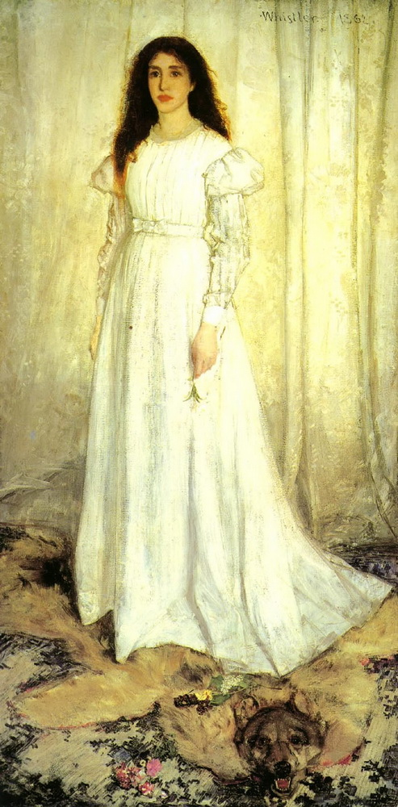
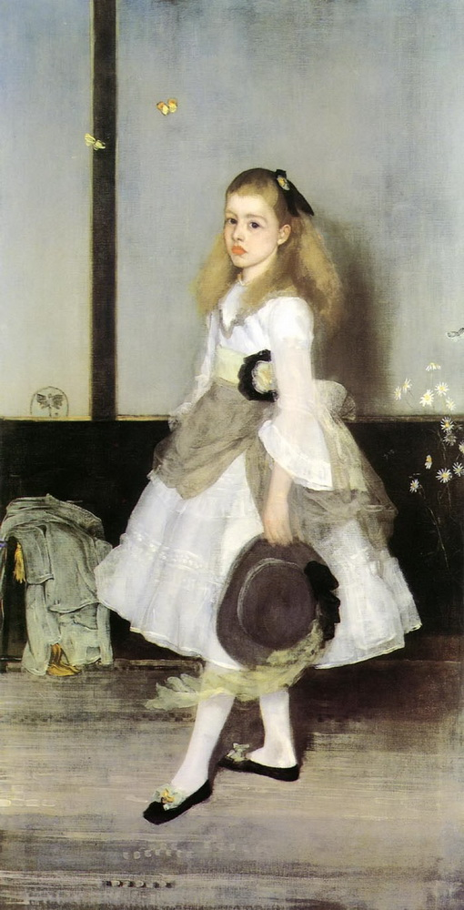

```
HISTORY OF MODERN ART
PAINTING SCULPTURE ARCHITECTURE PHOTOGRAPHY
SEVENTH EDITION

H.H.Arnason,Elizabeth_C.Mansfield
MolyChin 编译
Modern Art-002
```

||
|:---:|
|Abraham Teniers,《猴子的吸烟俱乐部》|

### The Origins of Modern Art
“I have seen, and heard, much of cockney impudence before now; but never expected a coxcomb to ask two hundred guineas for flinging a pot of paint in the public’s face.”

John Ruskin, Fors Clavigera, 1877 With this affront, John Ruskin (1819–1900) touched off a firestorm in the staid art world of late Victorian Britain. Ruskin was Britain’s most influential art critic. The target of his attack: James McNeill Whistler’s painting, Nocturne in Black and Gold: The Falling Rocket (fig. 1.1).  
Ruskin’s acidic review—in which he essentially accused the painter of being a charlatan whose only aim was to bilk art collectors of their money—provoked Whistler (1834–1913) to sue the critic for libel. The case went to court in 1878.  
The trial drew many spectators, eager to watch the eminent critic spar with the famously witty artist. Few observers were disappointed: according to newspaper accounts Whistler’s testimony was loaded with irony and sarcasm. For instance, when Ruskin’s attorney, John Holker, questioned the success of Nocturne in Black and Gold, asking of Whistler: “Do you think you could make me see beauty in that picture?”  
Whistler replied dryly: “No … I fear it would be as impossible as for the musician to pour his notes into the ear of a deaf man.”

### 现代艺术的起源  
*“我以前见过和听到过伦敦人的许多厚颜无耻的行为；但从来没有想到有一个这么不要脸的人会让两百个几内亚人向观众脸上扔颜料。“  
John Ruskin，Fors Clavigera，1877年*

随着这种冒犯，约翰-罗斯金（John Ruskin，1819-1900）在维多利亚时代晚期英国的沉闷艺术世界中引发了一场风暴。罗斯金是英国最具影响力的艺术评论家。他攻击的目标是詹姆斯-麦克尼尔-惠斯勒（James McNeill Whistler，1834-1913）的绘画《黑色和金色的夜曲：坠落的烟火》（图1.1）。  
罗斯金的刻薄评论——他几乎就是指责这位惠斯勒画家是个骗子，其唯一的目的就是骗取艺术收藏家们的金钱——这个批评挑起了诽谤案，并于1878年被起诉。  
审判吸引了许多吃瓜观众，他们渴望围观这两位著名的评论家与机智的艺术家间的对决。似乎并没有让围观者感到失望：据报纸报道，惠斯勒的证词充满了讽刺和挖苦。例如，当罗斯金的律师（ John Holker）质疑《黑色和金色夜曲：坠落的烟火》的成功时，他要求惠斯勒回答：“你认为你能让我看到这幅画中的美女吗？”    
惠斯勒干巴巴地回答道：“不......我想恐怕音乐家想要将他的音符硬塞进聋子的耳中是不可能的。”

||
|:---:|
|1.1 詹姆斯·麦克尼尔·惠斯勒，《黑色和金色夜曲：坠落的烟火》，约1875年。板上的油画，23×18英寸（60.3×46.4 cm）底特律艺术学院，底特律|

放到150年后的今天，大家也都能看到上面这幅《黑色和金色夜曲》，不知道当下，面对当时就价值200多英镑的绘画，你会站在那一边？  
惠斯勒在完成这幅绘画后，曾富有激情写到：“幕雾像一层面纱，富有诗意地笼罩在河畔，本来微弱可见的建筑物，在昏暗的天空下消失了；在这夜色中，高大的烟囱变成了钟楼，仓库俨然成了宫殿，整个城市悬浮在空中，我们所见谓为仙境。。。歌唱大自然中最和谐的，只有艺术家们，因为他们最爱她，也理解她，这是一首动听的歌曲。”

As amusing as these theatrics were, there were nonetheless important issues at stake for the history of modern art. In many ways, the defendant in the case was not simply the art critic John Ruskin, but art—especially modern art—itself.  
What was in the balance here? One weighty question concerned the role of art in society. Ruskin believed that art possessed the power to improve society. For him, this was accomplished chiefly through an artwork’s ability to represent nature faithfully. To encounter nature in its purity and grandeur, for Ruskin, was to contemplate the divine.  
Artists who adhered to his doctrine of “truth to nature” could, he thought, promote moral virtue as well as aesthetic pleasure. In Whistler’s Nocturne in Black and Gold, Ruskin found neither the moral nor the pictorial clarity he desired.  
Whistler’s attempt to capture the dazzling effects of a fireworks display over the Thames through startling, explosive brushwork defied the critic’s understanding of nature as a product of divine creation.

||
|:---:|
|惠斯勒，《在钢琴旁》，这是画家来到英国后卖出的第一幅作品。|

尽管这些插曲很有趣，但现代艺术史的确仍然存在一些的重要问题。在许多方面，**本案的被告不仅仅是艺术评论家约翰·罗斯金，而是艺术，尤其是现代艺术本身。**  

这里的悬而未决的疑问是什么呢？一个重要的问题是 **艺术在社会中的作用**。罗斯金认为艺术具有改善社会的力量。对他来说，这主要是通过艺术品忠实地表现自然的能力来完成的。对罗斯金来说，为了体验其纯洁和宏伟的自然，就是在思考神圣。  
他认为，坚持他的“对自然的真理”学说的艺术家可以促进道德美德和审美愉悦。在惠斯勒的《黑色与金色夜曲》中，罗斯金 **既没有找到他想要的道德标准，也没有找到他想要的画面清晰度**。    
惠斯勒则试图通过惊人的、爆炸性的笔触捕捉泰晤士河上空烟花表演的眩目效果，这违背了评论家对自然的理解，他认为自然是神圣创造的产物（并非画家的个人臆想可以支配的）。

Whistler subscribed to a very different understanding of art’s purpose. An adherent of the doctrine of “Art for Art’s Sake,” Whistler believed that true art served no social purpose whatsoever. Followers of the Art for Art’s Sake doctrine (see Gautier, Preface to Mademoiselle de Maupin, p. 2) held social utility under suspicion if not contempt, believing that a work’s usefulness threatened to detract from its purely aesthetic purpose. “Art,” Whistler explained, “has become foolishly confounded with education.” For supporters of Art for Art’s Sake, beauty was simply the measure of a work’s ability to stimulate a pleasing aesthetic sensation. The trial of Whistler vs. Ruskin pitted not just two men against each other, but provided a forum for the debate between those who looked to art as essential to social progress and those who insisted that art transcended social concerns. This debate would continue long after the conclusion of the trial, with various modernist movements allying themselves to one or the other viewpoint.

||
|:---:|
|惠斯勒，《白衣少女》，这幅落选法国沙龙的作品，一再遭到当时批评界的拒绝，由此画家与批评界产生了不可调和的矛盾，并几乎伴随其终身。|

惠斯勒对艺术的目的有着完全不同的理解。惠斯勒坚持“**为了艺术而艺术（Art for Art’s Sake）**”的学说，他认为 **真正的艺术根本没有社会目的**。“为艺术而艺术”的信条（见戈蒂埃-莫平小姐的序言），如果不轻视的话，他们对社会效用持怀疑态度，认为 **一件作品的实用性可能会削弱其纯粹的审美目的**。“艺术”，惠斯勒解释说，“已经愚蠢地被教育蒙蔽了。”对于艺术的支持者来说，美仅仅是衡量一件作品是否有能力激发一种令人愉悦的美感。惠斯勒对罗斯金的审判不仅使两个人相互对立，而且为那些认为艺术对社会进步至关重要的人和那些坚持艺术超越社会关注的人之间的对立观点提供了一个辩论的舞台。这场辩论将在审判结束后很长一段时间内继续进行，各种现代主义运动都倾向于其中的一个或另一个观点。

#### SOURCE
Théophile Gautier
Preface to Mademoiselle de Maupin (1835) The first statement of Art for Art’s Sake appeared in Gautier’s preface to a novel. Critics and censors found the preface objectionable for its seeming hedonism.  
…Someone has said somewhere that literature and the arts influence morals. Whoever he was, he was undoubtedly a great fool. It was like saying green peas make the spring grow, whereas peas grow because it is spring…. Nothing that is beautiful is  indispensable to life. You might suppress flowers, and the world would not suffer materially; yet who would wish that there were no flowers? I would rather give up potatoes than roses…. There is nothing truly beautiful but that which can never be of any use whatsoever; everything useful is ugly, for it is the expression of some need, and man’s needs are ignoble and disgusting like his own poor and infirm nature. The most useful place in a house is the water-closet.

---
##### ■源头
*《Mademoiselle de Maupin的序言》（1835年），"为艺术而艺术"的第一次陈述出现在Gautier的小说序言中。批评家和审查人员认为序言因其看似享乐主义而令人反感。*

......有人在某处说文学和艺术会影响道德。 无论他是谁，他无疑是个傻瓜。 这就像说绿豌豆使春天成长，而豌豆却是因为春天而生长...任何美丽的事物都是生命不可缺少的。你可以压制花朵，世界也不会因此遭受物质上的痛苦；但谁会希望没有花朵呢？我宁愿放弃土豆而不是玫瑰...世上没有真正美丽的东西，只有那些永远不能用的东西；一切有用的东西都是丑陋的，因为它是某种需要的表达，人的需要是不光彩的，令人厌恶的，就像他自己的贫弱天性一样。房子里最有用的地方是厕所。  

---
#### Making Art and Artists:
##### The Role of the Critic

Ruskin’s insistence on the ability of art to improve society led him to develop ways of bringing fine arts education to members of the working class. In addition to sponsoring art exhibitions and lectures for working-class audiences, Ruskin published a newsletter he hoped would appeal to workingclass readers. It was in this newsletter, Fors Clavigera, that he published his provocative review of Whistler’s painting.  
Ruskin’s advocacy for the working class and his efforts to provide laborers with access to forms of culture typically beyond their experience likewise colored the clash between critic and artist. On the one hand, Ruskin’s condemnation of Whistler’s painting speaks to his interest in supporting art that offers an immediate and accessible social message.

||
|:---:|
|惠斯勒，《红色午睡中音符》|

#### 制作艺术和艺术家
##### 评论家的角色

罗斯金坚持艺术改善社会的能力，这使他投入到将美术教育带给工人阶级的活动中去。 除了赞助工人阶级观众的艺术展览和讲座外，罗斯金还出版了一份他希望能吸引工人阶级读者的新闻通讯。正是在这篇通讯中，福斯·克莱维格拉（Fors Clavigera）发表了他对惠斯勒绘画的挑衅性评论。  
罗斯金对工人阶级的倡导以及他为劳动者提供获取超越他们经验的文化形式的努力，同样也给批评家和艺术家之间的冲突增添了色彩。一方面，罗斯金对惠斯勒画作的谴责说明了他对支持艺术的兴趣，这种艺术提供了一种即时的、易于理解的社会信息。

On the other hand, Ruskin drew on class-based stereotypes in his denigration of the artist. By attributing to Whistler a “cockney impudence,” Ruskin delivers an insult that turns on class differentiation: the adjective “cockney” was used in the nineteenth century to designate a Londoner who lacked the refinement of the gentry. In this way, Ruskin not only tapped into Whistler’s well-known sensitivity about his social status but also exposed the persistence of class as a means of differentiating artists from their patrons. As subsequent chapters will show, this divide between artists and patrons, between those who create art and those who consume it, troubled many modern artists.  
Along with such artists, many critics of modern art sought to bridge the divide between culture and its diverse potential audiences. Art criticism as a distinct literary or journalistic activity emerged in the eighteenth century in response to the proliferation of public venues for exhibiting art. Prior to that, artworks had remained largely confined to the private galleries of the nobility or other wealthy collectors. For the most part, only religious art was regularly viewed by the general public. By the early eighteenth century, this had changed. Not only were art dealers and even auctioneers beginning to stage public displays of their wares, but largescale exhibitions were being mounted throughout Western Europe, following the French model of public exhibitions sponsored by the monarchy. In France, these exhibitions were known as Salons because of the name of the room in which they were originally held at the Louvre Palace:

||
|:---:|
|惠斯勒，《灰色和黑色改编曲-艺术家母亲的肖像》，惠斯勒试图在色彩上加强形象的音乐感受力，因此，他广泛采用音乐术语，如和声、交响曲、变奏曲、改编曲等等。这些画，形象依然是写实并且精制的，只是用音乐的术语来点题。这在当时是新鲜的美学联想。|

另一方面，罗斯金在贬低艺术家的过程中，借鉴了基于阶级的刻板印象。罗斯金把惠斯勒归为“伦敦人的厚颜无耻”一词，这是一种使阶级分化的侮辱语言：19世纪，人们用“伦敦人”这个形容词来形容一个缺乏绅士风度的伦敦人。这样一来，罗斯金不仅利用了惠斯勒对社会地位的敏感度，还揭露了作为区分艺术家与赞助人的一种手段的阶级坚持。正如后面的章节所显示的那样，**艺术家和赞助人之间、创造艺术的人和消费艺术的人之间的这种鸿沟困扰着许多现代艺术家**。  
与这些艺术家一起，许多现代艺术评论家试图弥合文化与其多样化的潜在受众之间的鸿沟。艺术批评作为一种独特的文学或新闻活动，出现在18世纪，以应对公共场所艺术展览的激增。在此之前，艺术品主要局限于贵族或其他富有收藏家的私人画廊。在在大多数情况下，公众经常只能看到宗教艺术。到18世纪初，这种情况已经发生了改变。不仅是艺术品经销商，甚至拍卖商开始公开展示他们的商品（艺术品），而且整个西欧都在举办大型展览，仿效法国的君主制赞助的公共展览模式。在法国，这些展览之所以被称为沙龙，是因为它们最初在卢浮宫举办的房间而得名。

||
|:---:|
|Robert Hubert,《1801年至1805年卢浮宫大画廊》|

the Salon Carré or “Square Parlor.” The Paris Salon took place regularly, usually every two years, and would feature hundreds of artworks, mostly by members of France’s Royal Academy of Painting and Sculpture. Works by promising Academy students as well as prominent foreign artists were also shown. An official, public event, the Salon was open to anyone who wished to view the works on display. Other European countries soon followed France’s example, leading to a proliferation of regular public exhibitions in all the major European capitals by the early nineteenth century.  
In the early years of the Salon, the unprecedented access to artworks brought viewers face to face with an often confusing variety of subjects, styles, and media. To help guide visitors through the exhibitions, self-appointed arbiters of aesthetic quality began to write reviews, which would then be disseminated as pamphlets, in newspapers, or by private subscription. It did not take long for the art critics to have an effect on public taste. Even artists occasionally followed the advice of critics in their pursuit of public approbation.

巴黎沙龙通常每两年举行一次，展出数百件艺术品，主要由法国皇家绘画和雕塑学院的成员创作。此外，还展出有前途的大学生以及杰出的外国艺术家的作品。这是一个官方的公共活动，沙龙向任何想观看展出作品的人开放。其他欧洲国家很快也效仿了法国的做法，到19世纪初，欧洲所有主要首都的定期公共展览数量激增。  
在沙龙的早期阶段，前所未有的艺术作品使观众面对面经常混淆的各种主题，风格和媒体。为了帮助引导游客参观展览，自我任命的审美质量的仲裁者开始写评论，然后以小册子、报纸或私人订阅的形式进行传播。艺术评论家不久就影响到了公众的品味。甚至艺术家偶尔也会听从批评家的建议，寻求公众的认可。

||
|:---:|
|Henri Fantin Latour,《巴蒂诺尔的工作室》|

Of great interest to early critics of the Salon was the specific genre pursued by different artists. “Genre” refers generally to the type of subject represented in a painting. There were five main genres: history (depicting biblical, mythological, or historical subjects), landscape, portrait, still life, and (slightly confusingly) “genre painting” (scenes of everyday life). The French Royal Academy, at the time of its foundation in 1648, held that history painting was the greatest achievement for a painter because historical subjects demanded erudition as well as the highest degree of technical skill. Based on subjects from ancient or modern history, classical mythology, or the Scriptures, history painting required a thorough knowledge of important literary and historical texts. What is more, most history paintings were expected to present one or more heroic figures, often depicted nude, so anatomy and life drawing were an essential part of a history painter’s education. Finally, history paintings are often set in real or imagined towns, on  battlefields, or in other landscapes, and thus required the ability to execute works in that genre as well. As vaunted as history painting was by the Academy, early critics, such as Denis Diderot, often guided their readers toward other genres such as landscape, still life, and genre painting. Among the most attentive readers of art criticism were art dealers and collectors. This remains the case today.

早期的沙龙评论家非常感兴趣的是不同艺术家追求的特定类型。“体裁”一般指一幅画所代表的主题类型。主要有五种类型：历史（描绘圣经、神话或历史主题）、风景、肖像、静物画和（稍微令人困惑的）“风俗画”（日常生活场景）。法国皇家学会在1648成立的时候，**认为历史绘画是画家最大的成就，因为历史题材需要博学和技术技能的最高水平**。历史绘画以古代或现代史、古典神话或经文为题材，要求对重要的文学和历史文本有透彻的认识。更重要的是，大多数历史绘画都被期望呈现一个或多个英雄人物，通常是裸体的，因此解剖和生活绘画是历史画家教育的重要组成部分。最后，历史绘画往往被设置在真实或想象中的城镇、战场或其他景观，因此需要有能力执行该类型的作品。尽管历史绘画受到学院的吹捧，但早期的批评家，如丹尼斯·迪德罗（Denis Diderot），常常引导他们的读者转向其他类型，如风景画、静物画和风俗画。**艺术评论中最细心的读者是艺术品经销商和收藏家。今天仍然如此。**

### A Marketplace for Art
As mentioned above, many of the earliest public exhibitions of artwork were organized by dealers and auctioneers. This phenomenon marks an important shift in the role of art in society. Economic changes in Western Europe—the seventeenth-century expansion of mercantilism, which depended on favorable international trade balances and sales of manufactured goods, and the eighteenth-century development of capitalism, which encouraged the further spread of manufacturing beyond the limits of state control to encompass private investment as well—contributed to the ascendance of the bourgeoisie, a class of citizens with newly acquired economic strength and a taste for the fashions and habits of the nobility (see Modernity and Modernism, opposite).  
Collectors from the middle as well as upper registers of society now sought to fill their homes with beautiful things, including artworks, creating a demand especially for small paintings and tabletop sculptures that would fit comfortably in a townhouse or apartment. Thus, during the eighteenth century, a market force was introduced into the art world, leading to a proliferation in the nineteenth century of smaller works with themes suited to a bourgeois domestic interior. It is precisely this market, in fact, to which Whistler hoped to appeal with the modest scale and striking effects of his Nocturne in Black and Gold, a painting that measures less than two feet high and a foot and a half wide.

||
|:---:|
|惠斯勒，《蓝色和银色夜曲》|


### 艺术市场
如上所述，许多最早的艺术品公开展览都是由经销商和拍卖商组织的。这一现象标志着艺术在社会中的作用发生了重大转变。西欧的经济变化，十七世纪重商主义的扩张，依赖于有利的国际贸易平衡和制成品的销售，以及十八世纪的资本主义发展，这促使制造业进一步扩散到国家控制的范围之外包括私人投资，也有助于资产阶级的崛起。资产阶级是一类具有新的经济实力和贵族时尚品味和习惯的公民（见《现代性与现代主义》）。  
如今，来自社会中上层的收藏家们现在寻求用包括艺术品在内的精美物品填满他们的家，特别是那些适合联排别墅或公寓的小型绘画和桌面雕塑。因此，在十八世纪，一股市场力量被引入了艺术世界，导致十九世纪越来越多的小型作品以适合资产阶级家庭内部的主题。事实上，正是这个市场，惠斯勒希望能以他那《黑色和金色夜曲》的适度规模和惊人的效果来吸引观众，这幅画不到两英尺高，一英尺半宽。

All of these currents—art’s role in society, increasing class tension, proliferating art exhibitions, the growing influence of art critics, and the expanding market for art—converged in the Whistler vs. Ruskin trial. And all of these phenomena contributed to the development of modern art. But perhaps more than any of these pressures, the real issue motivating Whistler’s confrontation with Ruskin involved a problem fundamental to modernism: What is art? Whistler in fact offered an answer to this question during the trial. When attorney Holker attempted to clear his client of libel by indicating that Whistler really was a charlatan committing fraud, he pointed out that Nocturne in Black and Gold could not possibly be a finished artwork because there simply had not been sufficient labor or time invested in the piece. Holker asked, “Did it take you long to paint the Nocturne in Black and Gold? How soon did you knock it off?” Whistler replied, “Oh, I knock one off in a couple of days.” The barrister then asked Whistler if it was merely “the labour of two days” for which he charged more than £200? To this question Whistler responded, “No, I ask it for the knowledge of a lifetime.”  
Whistler won the case. Though it was a pyrrhic victory for the painter, whose receipt of only a farthing—less than a penny—in damages cast him into bankruptcy, Whistler’s statement nonetheless announces the establishment of one of modernism’s central tenets: that art is first and foremost the manifestation of an individual’s emotional and intellectual will.

||
|:---:|
|惠斯勒，《灰与绿和谐的西西里·亚历山德小姐》|

所有这些潮流都汇集在惠斯勒与罗斯金的审判中，**艺术在社会中的作用、日益加剧的阶级紧张、不断扩大的艺术展览、艺术评论家日益增长的影响力以及不断扩大的艺术市场。所有这些现象都促进了现代艺术的发展**。但也许比这些压力更大的是，促使惠斯勒与罗斯金对抗的真正问题涉及到一个现代主义的根本问题：**什么是艺术**？事实上，惠斯勒在审判期间回答了这个问题。当霍尔克律师试图通过暗示惠斯勒确实是一个骗子来澄清他的当事人的诽谤时，他指出《黑色和金色的夜曲》不可能是一件成品艺术品，因为在这件作品上画家根本没有足够的人力或时间投入。霍尔克问：“你花了很长时间才把夜曲涂成黑色和金色吗？你多久把它弄出来的？”惠斯勒回答说：“哦，我几天内就把它画好了。”然后律师问惠斯勒，这是否仅仅是“两天的劳动”，他为此收取了200多英镑？对于这个问题，惠斯勒回答说：“不，我要的是终生的知识。”  
惠斯勒赢了这个官司。虽然这对画家来说是一个巨大的胜利，但是他只收到了不到一分钱的损害赔偿金，这使他破产了。但惠斯勒的声明却宣告了现代主义的核心原则之一的确立：“**艺术首先是个人情感和智力意志的表现。**”

---
#### CONTEXT  
##### Modernity and Modernism  
With industrialization in Western Europe and North America came modernity: cities grew as dwindling agricultural jobs prompted workers to seek employment in manufacturing.  
The population booms in cities such as Paris and London led to an expansion of businesses aimed at serving the needs of these new citizens: restaurants, bars, theaters, music halls, boarding houses, and inns proliferated. These businesses created more jobs while also introducing new social habits and expectations. Rooted in urban culture, where leisure activities as well as daily necessities are available commercially, modernity refers to the condition of post-industrial, capitalist society. Modernism is simply the cultural expression of this form of social organization. Associated with ideas of progress and novelty, modernism reflects the dominant ethos of a society in which consumption—of new forms of entertainment along with the necessities of life—plays a central role in one’s daily activities. One of the signal markers of the rise of modernism in the West was the advent of the department store and the idea of shopping as a leisure activity.  
Just as indicative of modernism was a pervasive ambivalence toward modernity itself. Many welcomed the technological advances and economic prosperity that modernity seemed to foster. Others, however, were wary of its emphasis on change and continual improvement, noting capitalism’s tendency to exploit workers murderously and to contribute to the deplorable living conditions of the poor. Modern art, like all forms of modernism, is a response to the diverse political, economic, and cultural pressures of modernity.

||
|:---:|
|惠斯勒，《瓷器之国（中国）的公主》|

#### 语境
##### 现代性与现代主义
西欧和北美的工业化带来了现代性：随着农业就业的减少，促使工人在制造业中寻求就业，城市也随之增长。  
巴黎和伦敦等城市的人口激增导致了旨在满足这些新公民需求的商业机构的扩张：餐馆、酒吧、剧院、音乐厅、寄宿处和旅馆激增。这些机构创造了更多的就业机会，同时也引入了新的社会习惯和期望。现代性植开始根于城市文化之中，它是指向后工业时代、资本主义社会的条件。在城市文化中，休闲活动和日常生活用品都是商业性的。现代主义只是这种社会组织形式的文化表现。现代主义与进步和新颖的观念相结合，反映了一个社会的主导精神，在这个社会中，新形式的娱乐和生活必需品的消费在人们的日常活动中起着核心作用。现代主义在西方兴起的标志之一是百货公司的出现和购物成为休闲活动的想法。  
正如 **现代主义** 的象征一样，对 **现代性** 本身存在普遍的矛盾心理。正如现代主义的指向是对现代性本身的普遍矛盾。许多人欢迎现代性似乎来源于技术的进步和经济的繁荣。然而，其他人则担心其强调改变和持续改进，并指出资本主义倾向于残酷地剥削工人并使贫困人口陷入悲惨生活条件。与所有形式的现代主义一样，现代艺术是对现代性的各种政治，经济和文化压力的回应。

---
||
|:---:|
|Alexandre Brun，《卢浮宫客厅的景色》|


>continue.....
