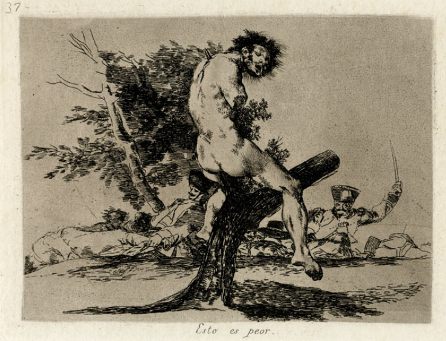

```
HISTORY OF MODERN ART
PAINTING SCULPTURE ARCHITECTURE PHOTOGRAPHY
SEVENTH EDITION
H.H.Arnason,Elizabeth_C.Mansfield
MolyChin 编译
Modern Art-003
```
### The Modern Artist
The notion that an artwork is fundamentally the expression of a particular artist’s thoughts or desires seems obvious today. But this has not always been the case. The idea that Whistler put forward is rooted—like many sources of modernism—in the eighteenth century. Until the late eighteenth century, artists in the West since the Renaissance had understood their work as part of a tradition going back to classical antiquity. Though each artist was expected to contribute uniquely to this tradition, the practice of emulation remained central to any artist’s training. Young artists would learn to create by first copying works acknowledged as superior examples of their genre, style, or medium. Only after a student fully understood the work of earlier artists and was able to reproduce such examples faithfully could he or she go on to create new forms. But even then, new works were expected to contribute to established traditions. This was the method of training used at art academies throughout Western Europe from the seventeenth through the nineteenth centuries. Artists achieved success by demonstrating their inventiveness within the tradition in which they worked.
**从根本上说，艺术品是特定艺术家思想或欲望的表达，这种观点在今天看来是显而易见的**。但情况并非总是如此。惠斯勒提出的观点和18世纪许多现代主义的根源一样。直到18世纪末，文艺复兴以来的西方艺术家们都把他们的作品理解为古典古代传统的一部分,这种传统可以追溯到古典时期。尽管每个艺术家都被期望为这个传统做出独特的贡献，但模仿的实践仍然是任何艺术家训练的核心。年轻的艺术家们将通过被公认为是其流派、风格或媒介的优秀范例的复制作品来学习创作。只有当学生完全理解早期艺术家的作品，并且能够忠实地复制这些例子后，他才能继续创造新的形式。但即便如此，新的作品也有望为既定的传统做出贡献。从十七世纪到十九世纪，这是整个西欧艺术学院使用的培训方法。艺术家们通过在他们工作的传统中展示他们的创造力而获得成功。
For instance, one of the consummate achievements of eighteenth-century French academic art is Jacques-Louis David’s Neoclassical painting The Oath of the Horatii (fig.1.2). The subject is taken from classical sources and had been treated earlier by other painters. For his version, David (1748–1825) emulates the crisp linearity, rich colors, and sculptural treatment of figures by earlier painters such as Nicolas Poussin, relying on him for the clear, geometrical arrangement: the bold pentagon holding old Horatio and his sons, the oval grouping of despondent women on the right. David has radically compressed the clear, stage-like architectural setting in emulation of ancient relief sculpture.
Of course, David’s treatment of the theme as well as his rendering of figures and space was heralded for its freshness and novelty at the time of its initial exhibition in 1785. At this time, however, novelty and originality were subsumed within the conventions of artistic tradition.
例如，18世纪法国学术艺术的成就之一就是雅克·路易斯·大卫(Jacques-Louis David，1748-1825)的新古典主义绘画《荷瑞提誓言》（图1.2）。这个主题来源于古典，并已被其他更早的画家反复运用过。在他的版本中，大卫效仿了早期画家尼古拉斯·普桑（Nicolas Poussin）对人物的清晰线性、丰富的色彩和雕刻处理，依靠他清晰的几何布局：大胆的五角大楼抱着老霍雷肖和他的儿子，椭圆形的绝望女性群体在右边。大卫从根本上压缩了清晰的舞台式建筑设置，以模仿古代的浮雕。
当然，大卫对这一主题的处理，以及他对人物和空间的描绘，在1785年首次展出时，也因其新鲜和新颖而受到了人们的欢迎。然而，在这一时期，新颖性和独创性被纳入了艺术传统的惯例之中。
---
该主题取自经典来源，并已被其他画家早先处理过。 在他的版本中，大卫（1748-1825）模仿了早期画家尼古拉斯·普辛（Nicolas Poussin）对人物的清晰线性，丰富的色彩和雕塑处理，依靠他的清晰，几何排列：拿着老霍雷肖及其儿子的大胆的五角大楼 ，右边是沮丧的妇女的椭圆形分组。 大卫在模仿古代浮雕雕塑时，彻底压缩了清晰的舞台般的建筑环境。
当然，大卫对主题的处理以及他对人物和空间的渲染在1785年首次展览时的新鲜感和新颖性得到了预示。然而，此时，新颖性和原创性被归入艺术惯例之中。 传统。
||
|:---:|
|David, Jacques-Louis,《Horatii誓言》，Jacques-Louis David, The Oath of the Horatii, 1784. Oil on canvas, 10’ 10”  14’ (3.4  4.3 m). Musée du Louvre, Paris.|
What Does It Mean to Be an Artist?
From Academic Emulation toward Romantic Originality
The emphasis on emulation as opposed to novelty begun to lose ground toward the end of the eighteenth century when a new weight was given to artistic invention. Increasingly,invention was linked with imagination, that is to say, with the artist’s unique vision, a vision unconstrained by academic practice and freed from the pictorial conventions that had been obeyed since the Renaissance. This new attitude underlies the aesthetic interests of Romanticism. Arising in the last years of the eighteenth century and exerting its influence well into the nineteenth, Romanticism exalted humanity’s capacity for emotion. In music, literature, and the visual arts, Romanticism is typified by an insistence on subjectivity and novelty. Today, few would argue that art is simply the consequence of creative genius. Romantic artists and theorists, however, understood art to be the expression of an individual’s will to create rather than a product of particular cultural as well as personal values. Genius, for the Romantics, was something possessed innately by the artist: It could not be learned or acquired. To express genius, then, the Romantic artist had to resist academic emulation and instead turn inward, toward making pure imagination
visible. The British painter and printmaker William Blake (1757–1827) typifies this approach to creativity.
### 做一个艺术家意味着什么？
#### 从学术模仿到浪漫创意
与新颖性相比，对仿真的重视在18世纪末开始逐渐失去了基础，当时艺术发明受到了新的重视。发明越来越多地与想象联系在一起，也就是说，与艺术家独特的视觉联系在一起，这种视觉不受学术实践的约束，也不受文艺复兴以来遵循的绘画惯例的约束。这种新的态度是浪漫主义美学利益的基础。浪漫主义产生于18世纪的最后几年，并一直到19世纪发挥其影响，从而提高了人类的情感能力。在音乐、文学和视觉艺术中，浪漫主义表现为对主体性和新颖性的坚持。今天，很少有人会认为艺术仅仅是创造天才的结果。然而，浪漫主义艺术家和理论家把艺术理解为个人意志的表达，而不是特定文化和个人价值观的产物。对于浪漫主义者来说，天才是艺术家天生拥有的东西：它不能被学习或获得。为了表现天才，浪漫主义艺术家不得不抵制学术上的模仿，转而向内，让纯粹的想象可见。英国画家和版画制作者威廉·布莱克（1757-1827）就是这种创造性的典型。
---
成为艺术家意味着什么？：
从学术仿效到浪漫主义创作
在18世纪末，当艺术发明受到新的重视时，对新颖性的反对的强调开始逐渐消失。越来越多的发明与想象力联系在一起，也就是说，艺术家独特的视野，不受学术实践约束的视野，以及从文艺复兴以来一直遵循的图画惯例中解脱出来。这种新态度是浪漫主义审美兴趣的基础。在十八世纪的最后几年里，浪漫主义在十九世纪的最后几年中发挥了很大的作用，提升了人类对情感的能力。在音乐，文学和视觉艺术中，浪漫主义的典型是坚持主观性和新颖性。今天，很少有人会认为艺术只是创造性天才的结果。然而，浪漫的艺术家和理论家认为艺术是个人创造意志的表达，而不是特定文化和个人价值的产物。天才，对于浪漫主义者来说，是艺术家天生拥有的东西：无法学习或获得。因此，为了表达天才，浪漫主义艺术家不得不抵制学术模仿，而是向内转，使纯粹的想象变得可见。英国画家和版画家威廉布莱克（1757-1827）代表了这种创造力的方法。
||
|:---:|
|BLAKE_William,《尼布甲尼撒》，William Blake, Nebuchadnezzar, 1795. Color print fi nished in ink and watercolor on paper, 21  28” (54.3  72.5 cm). Tate, London.|
Producing prophetic books based in part on biblical texts as well as on his own prognostications, Blake used his training as an engraver to illustrate his works with forceful, intensely emotional images. His depictions of familiar biblical personages, for instance, momentarily evoke for the viewer conventional representations before spinning away from the familiar into a strange new pictorial realm. His rendering of Nebuchadnezzar (fig. 1.3) shows the Babylonian king suffering the madness described in the Book of Daniel.
The nudity and robust muscularity of the king might initially remind the viewer of the heroic Old Testament figures who people Michelangelo’s Sistine Chapel ceiling, but the grimacing expression and distortions of the figure— which emphasize the king’s insanity as he “did eat grass as oxen”—quickly dispel thoughts of classical prototypes or quiet grandeur.
With Jacques-Louis David and William Blake, we have representatives of the two dominant art styles of the late eighteenth century: Neoclassicism and Romanticism. Both of these styles—along with the growing influence of art criticism, a proliferation of public art exhibitions, and an expansion in the number of bourgeois patrons and collectors—helped to lay the foundations of modern art. David’s Neoclassicism carried into the  nineteenth century an awareness of tradition along with a social conscience that enabled art to assume a place at the center of political as well as cultural life in Europe. Blake’s Romanticism poured a different strain into the well from which modern art is drawn.With its insistence that originality is the mark of true genius,Romanticism demands of modern art an unceasing pursuit of novelty and renewal.
布莱克创作的预言书部分基于圣经文本和他自己的预言，他利用自己作为雕刻师的训练，用有力的、强烈的情感图像来说明他的作品。例如，他对熟悉的圣经人物的描述，在脱离熟悉的事物进入一个陌生的新绘画领域之前，瞬间唤起了观众的传统印象。他对尼布甲尼撒的描绘（图1.3）显示巴比伦王遭受了但以理书中描述的疯狂。
国王的裸露和强健的肌肉最初可能会让观众想起那些英雄般的旧约人物，他们是米开朗基罗西斯廷教堂天花板上的人物，但是这个人物的表情和扭曲——强调了国王的精神错乱，因为他“吃草如牛”——很快消除了对古典原型的思考。或安静的宏伟。
与雅克·路易斯·大卫和威廉·布莱克一起，我们代表了18世纪晚期两种主要的艺术风格：**新古典主义**和**浪漫主义**。这两种风格，加上艺术批评的影响越来越大，公共艺术展览越来越多，资产阶级赞助人和收藏家数量的增加，都为现代艺术奠定了基础。大卫的新古典主义将传统意识和社会良知带入十九世纪，使艺术成为欧洲政治和文化生活的中心。布莱克的浪漫主义为现代艺术的创作注入了另一种张力，它坚持独创性是真正天才的标志，浪漫主义要求现代艺术不断追求新颖和更新。
---
部分根据圣经文本以及他自己的预言制作预言书，布莱克使用他的训练作为雕刻师用强有力的，激烈的情感图像来说明他的作品。例如，他对熟悉的圣经人物的描绘，瞬间唤起观众的传统表现形式，然后从熟悉的旋转到一个奇怪的新图像领域。他对尼布甲尼撒的渲染（图1.3）显示巴比伦国王遭受了但以理书中描述的疯狂。
国王的裸体和强壮的肌肉发达可能最初提醒观众英雄的旧约圣经人物米开朗基罗的西斯廷教堂的天花板，但是这个人物的鬼脸表达和歪曲 - 强调国王的疯狂，因为他“吃草像牛一样” - 快速消除经典原型的思想或安静的宏伟。
雅克 - 路易斯大卫和威廉布莱克，我们有十八世纪晚期两种主流艺术风格的代表：新古典主义和浪漫主义。 这两种风格 - 以及艺术批评的日益增长的影响，公共艺术展览的激增，以及资产阶级赞助人和收藏家数量的扩大 - 有助于奠定现代艺术的基础。 大卫的新古典主义进入了十九世纪的传统意识和社会良知，使艺术成为欧洲政治和文化生活中心的一席之地。 布莱克的浪漫主义为现代艺术的绘制带来了不同的压力。由于其坚持原创性是真正天才的标志，浪漫主义对现代艺术的要求是对新颖性和更新的不断追求。
### Making Sense of a Turbulent World:
#### The Legacy of Neoclassicism and Romanticism
Neoclassicism, which dominated the arts in Europe and America in the second half of the eighteenth century, has at times been called a derivative style that perpetuated the classicism of Renaissance and Baroque art. Yet in Neoclassical art a fundamental Renaissance visual tradition was seriously opposed for the first time—the use of perspective to govern the organization of pictorial space. Perspective refers to a system for representing three dimensions on a two-dimensional surface, creating the illusion of depth. Artists since the Renaissance have used two main techniques for accomplishing this: linear perspective and atmospheric perspective.
Linear perspective suggests the recession of space through the use of real or implied lines, called “orthogonals,” which seem to converge at a point in the distance. Atmospheric perspective imitates the tendency of distant objects to appear less distinct to give the illusion of depth. It may be argued that David’s manipulation of perspective was crucial in shaping the attitudes that led, ultimately, to twentiethcentury abstract art.
David and his followers did not actually abandon the tradition of a pictorial structure based on linear and atmospheric perspective. They were fully wedded to the idea that a painting was an adaptation of classical relief sculpture:
they subordinated atmospheric effects; emphasized linear contours; arranged their figures as a frieze across the picture plane and accentuated that plane by closing off pictorial depth through the use of such devices as a solid wall, a back area of neutral color, or an impenetrable shadow. The result, as seen in The Oath of the Horatii, is an effect of figures composed along a narrow stage behind a proscenium, figures that exist in space more by the illusion of sculptural modeling than by their location within a pictorial space that has been constructed according to principles of perspective.
### 理解一个动荡的世界
#### 新古典主义和浪漫主义的遗产
新古典主义在18世纪下半叶统治着欧洲和美洲的艺术，有时被称为一种衍生风格，延续了文艺复兴和巴洛克艺术的古典主义。然而，在新古典主义艺术中，文艺复兴时期的一个基本视觉传统首次遭到严重反对，即用透视来管理绘画空间的组织。透视是指在二维表面上表示三维的系统，产生深度的错觉。文艺复兴以来，艺术家们使用了两种主要的技术来实现这一点：**线性透视**和**大气透视**。
线性透视图表明，通过使用实线或隐含线，即所谓的“正字词”，空间衰退，似乎收敛在一个点在距离。大气透视图模仿了遥远物体看起来不那么明显的趋势，给人一种深度错觉。有人可能认为，大卫对透视法的操纵对于塑造最终导致20世纪抽象艺术的态度至关重要。
大卫和他的追随者并没有真正放弃基于线性和大气透视的绘画结构的传统。他们完全相信绘画是对古典浮雕的改编：它们服从大气影响；强调线性轮廓；将它们的图形作为横穿图片平面的饰带排列，并通过使用诸如实心墙、中性色的背面区域或不可穿透的阴影等设备来关闭图形深度，从而突出该平面。结果，正如霍雷蒂誓言中所看到的，是沿着舞台后面狭窄的舞台组成的人物的效果，这些人物更多地是通过雕塑造型的错觉而不是根据透视原理在一个绘画空间中的位置而存在于空间中。
---
浪漫主义坚持原创性是真正天才的标志，它要求现代艺术不断追求新奇和更新。
理解一个动荡的世界：
新古典主义与浪漫主义的遗产
新古典主义在十八世纪下半叶主导了欧洲和美国的艺术，有时被称为衍生风格，使文艺复兴和巴洛克艺术的古典主义永久化。然而在新古典主义艺术中，文艺复兴时期的一种基本视觉传统首次遭到严重反对 - 利用视角来管理图像空间的组织。透视是指用于在二维表面上表示三维的系统，从而产生深度的幻觉。自文艺复兴以来，艺术家们使用了两种主要技术来实现这一目标：线性视角和大气视角。
线性透视通过使用称为“正交”的实线或暗线来表示空间的衰退，这些线似乎会聚在远处的某个点上。大气透视模仿了远处物体看起来不那么明显以产生深度幻觉的倾向。可能有人认为，大卫对视角的操纵对于塑造最终导致二十世纪抽象艺术的态度至关重要。
大卫和他的追随者实际上并没有放弃基于线性和大气视角的图像结构传统。他们完全坚持认为绘画是经典浮雕的改编：
他们从属于大气效应;强调线性轮廓;通过使用诸如实心墙，中性色的背景区域或不可穿透的阴影之类的装置，通过关闭图像深度来将他们的数字排列成画面上的带状物并强调该平面。结果，如在Horatii的誓言中看到的，是沿着舞台后面的狭窄舞台组成的人物的影响，在空间中存在的数字更多地是由于雕塑建模的幻觉而不是它们在已经构建的图像空间中的位置。根据观点的原则。
The clearest formal distinction between Neoclassical and Romantic painting in the nineteenth century may be seen in the approaches to plastic form and techniques of applying paint. Neoclassicism in painting established the principle of balanced frontality to a degree that transcended even the High Renaissance or the seventeenth-century classicism of Nicolas Poussin. Romantic painters relied on diagonal recession in depth and indefinite atmospheric–coloristic effects more appropriate to the expression of the inner imagination than the clear light of reason. The Neoclassicists continued the Renaissance tradition of glaze painting to attain a uniform surface unmarred by the evidence of active brushwork,whereas the Romantics were more experimental, sometimes reviving the richly impastoed surfaces of Baroque and Rococo paintings. During the Romantic era there developed an increasingly high regard for artists’ sketches, which were thought to capture the evanescent touch of the artist,thereby communicating authentic emotion. Such attitudes were later crucial for much abstract painting in America and France following World War II (see Chapters 17 and 18).
Printmaking likewise experienced a resurgence. Eager to exploit the capacity of prints to produce multiple copies,Romantic artists sought techniques that would endow prints with the spontaneity of drawings (see Printmaking Techniques, below). Blake created experimental relief etchings to pursue this interest. Romantic artists also quickly embraced the new process of lithography in order to achieve their goals. Among the earliest Romantic artists to utilize this medium was Théodore Géricault (1791–1824).
His Horse Devoured by a Lion from 1820–21 (fig. 1.4) uses lithography to explore a favorite Romantic theme: the nobility of animals in the face of unpitying nature. The immediacy of the lithographic line contributes to the subject’s drama, while Géricault’s manipulation of tone delivers velvety black passages that recede ominously in the background, framing the terrifying jaws of the lion.
19世纪新古典主义绘画和浪漫主义绘画之间最明显的正式区别可以从造型方法和绘画技巧中看出。绘画中的新古典主义确立了平衡正面性的原则，甚至超越了文艺复兴时期的文艺复兴时期或尼古拉斯·普桑的十七世纪古典主义。浪漫主义画家依靠的是深度上的对角线衰退和不确定的大气色彩效果，这比明晰的理性之光更适合于内心想象的表达。新古典主义者延续了文艺复兴时期釉料绘画的传统，以获得一个统一的表面，而没有活跃的笔触的证据，而浪漫主义者是更实验性的，有时恢复巴洛克和洛可可绘画的丰富厚重的表面。在浪漫主义时期，艺术家的素描受到越来越高的重视，人们认为素描捕捉了艺术家瞬间的感觉，从而传达出真实的情感。这种态度后来对二战后美国和法国的抽象绘画至关重要（见第17章和第18章）。
版画也经历了复苏。浪漫主义艺术家渴望利用印刷品的能力来制作多份复制品，他们寻求的技术可以赋予印刷品绘画的自发性（见下文的版画制作技术）。布莱克创造了实验性的浮雕蚀刻来追求这一兴趣。浪漫主义艺术家也很快接受了新的光刻工艺，以达到他们的目标。最早使用这一媒介的浪漫主义艺术家是特奥多雷·里考特（1791-1824）。
1820年至1821年，他的马被一头狮子吞食（图1.4），用石版印刷术探索了一个最受欢迎的浪漫主题：面对不道德的自然，动物的高贵。石版线条的直接性促成了主题的戏剧化，而G_ricault对音调的操纵则提供了柔和的黑色段落，这些段落在背景中逐渐退去，构成了狮子可怕的下颚。
||
|:---:|
|1.4 Théodore Géricault, Cheval Devoré par un Lion (Horse Devoured by a Lion), 1820–21. Lithograph; black lithographic ink on prepared “stone” paper, 1013⁄16  149⁄16” (27.4  37 cm). British Museum, London.|
---
十九世纪新古典主义和浪漫主义绘画之间最明确的正式区别可以从塑料形式和涂料技术的方法中看出。绘画中的新古典主义确立了平衡边缘的原则，甚至超越了文艺复兴时期或17世纪尼古拉斯普桑的古典主义。浪漫主义画家依靠深度的对角衰退和不确定的大气色彩效果更适合内在想象的表达，而不是清晰的理性之光。新古典主义者继续文艺复兴时期的釉画传统，以获得一个统一的表面，无法通过主动笔法的证据，而浪漫主义更具实验性，有时复兴巴洛克和洛可可绘画的丰富表面。在浪漫主义时代，人们越来越重视艺术家的素描，这些素描被认为能够捕捉艺术家的渐渐触动，从而传达真实的情感。这种态度后来对于第二次世界大战后美国和法国的抽象绘画至关重要（见第17章和第18章）。
版画制作同样经历了复苏。渴望利用印刷品的能力来制作多个副本，浪漫艺术家寻求的技术可以赋予印刷品图纸的自发性（参见下面的版画制作技术）。布莱克创造了实验性的浮雕蚀刻来追求这种兴趣。浪漫艺术家也很快接受了新的平版印刷工艺，以实现他们的目标。最早使用这种媒介的浪漫主义艺术家是ThéodoreGéricault（1791-1824）。
1820年至2121年，他的一只狮子吞噬了一头狮子（图1.4），用光刻技术探索了一个最受欢迎的浪漫主题：面对不自然的大自然的动物贵族。平版印刷线的即时性有助于主题的戏剧化，而Géricault对音调的操控提供了天鹅绒般的黑色通道，在背景中不祥地退缩，构成狮子的可怕下巴。
### History Painting
David and his followers tended toward history painting,especially moralistic subject matter related to the philosophic ideals of the French Revolution and based on the presumed stoic and republican virtues of early Rome. Yet painters were hampered in their pursuit of a truly classical art by the lack of adequate prototypes in ancient painting.
There was, however, a profusion of ancient sculpture. Thus,it is not surprising that Neoclassical paintings such as The Oath of the Horatii (see fig. 1.2) should emulate sculptured figures in high relief within a restricted stage, which David saw in Rome, where he painted The Oath. The “moralizing” attitudes of his figures make the stage analogy particularly apt. Although commissioned for Louis XVI, whom David, as a deputy of the Revolutionary government, later voted to send to the guillotine, this rigorous composition of brothers heroically swearing allegiance to Rome came to be seen as a manifesto of revolutionary sentiment.
### 历史绘画
大卫和他的追随者倾向于历史绘画，尤其是与法国大革命的哲学理想有关的道德主题，并基于早期罗马假定的坚忍和共和的美德。然而，由于在古代绘画中缺乏足够的原型，画家们在追求真正的古典艺术时受到了阻碍。
然而，有大量的古代雕塑。因此，毫不奇怪，新古典主义绘画，如荷瑞提的誓言（见图1.2），应该在大卫在罗马看到的一个有限的阶段内，在高浮雕中模仿雕刻的人物，在那里他画了誓言。他的人物的“道德化”态度使舞台比喻特别贴切。尽管路易十六被委托担任革命政府的副手，大卫后来投票送上断头台，但这一由英勇地宣誓效忠罗马的兄弟组成的严谨的作品被视为革命派的宣言。模仿。
---
历史绘画
大卫和他的追随者倾向于历史绘画，特别是与法国大革命的哲学理想相关的道德主题，并基于罗马早期的假定的斯多葛和共和主义美德。然而，由于古代绘画中缺乏足够的原型，画家因追求真正的古典艺术而受到阻碍。
然而，有大量的古代雕塑。因此，新古典主义绘画如Horatii的誓言（见图1.2）应该在限制阶段模仿高浮雕的雕刻人物，大卫在罗马看到他画的誓言，这并不奇怪。他的人物的“道德化”态度使得舞台比喻特别贴切。虽然委托路易十六作为革命政府的副手大卫后来投票给断头台，但是这个严厉的兄弟组成的英雄誓言对罗马的忠诚被视为革命情绪的宣言。
---
### TECHNIQUE
#### Printmaking Techniques
Prior to the invention of photography, the easiest way to reproduce images was through printmaking. Some artists were particularly drawn to this, often preferring the intimate scale and wide circulation afforded by prints. Two techniques—aquatint and lithography—became especially popular among Romantic artists.
Aquatint offered printmakers the ability to create passages of rich tone, ranging from pale grays to deep blacks. Early printmaking techniques—such as engraving—tended to rely on line only,which made it difficult to render shading. Engraving involves incising a line into a metal plate using a sharp instrument called a “burin.” Once the design is inscribed onto the plate, ink is applied to the surface. The ink settles into the lines and the surface of the plate is wiped clean. A piece of paper is then placed atop the design and, to receive the ink resting in the incised lines, the plate and paper are run through a printing press that exerts enough pressure to force the paper into the line where it receives the ink. But how to reproduce areas of tone, like a wash, rather than just line?
With aquatint a fine powdered resin is sprinkled onto the metal printing plate, which is heated so the resin melts and adheres in a pebbled pattern. By dipping the plate into a pan of acid, the parts of it not covered by the resin are eaten away by the acid.
This area, like the line of an engraving, holds ink for transfer onto a print. By using different patterns and thicknesses of resin along
with varying strengths of acid, the tonal range of an aquatint can be manipulated. Lithography is a different technique altogether,and does not require the metal plate used in engraving and aquatint. With lithography, the artist uses a crayon or other greasebased medium to draw a design onto a specially prepared block of porous limestone. Water applied to the surface is absorbed by the porous stone but repelled by the greasy ink. An oil-based ink is then applied to the surface: because of the natural repulsion between oil and water, the ink remains only on the areas marked by the artist. This surface can then be covered by a sheet of paper and run through a press using much less pressure than for an engraving or an aquatint. Lithography, because it does not require incising into a metal plate or the use of noxious acids, allows artists to
work much as they would when drawing, which accounts for the often free and spontaneous character of lithographs.
### 技术
#### 版画制作技术
在摄影发明之前，最简单的复制图像的方法是通过版画。一些艺术家特别喜欢这一点，他们往往更喜欢由印刷品提供的亲密规模和广泛流通。两种技术水彩和平版印刷术在浪漫主义艺术家中特别流行。
Aquatin为印刷商提供了创造丰富色调通道的能力，从浅灰色到深黑色。早期的版画制作技术，如雕刻，往往只依赖线条，这使得渲染阴影变得困难。雕刻涉及到使用一种叫做“burin”的锋利工具将一条线切割到金属板上。一旦设计被刻到金属板上，就会在金属板表面涂上墨水。墨水沉淀到线条中，然后将板的表面擦拭干净。然后将一张纸放在设计的顶部，然后，为了接收留在刻线中的墨水，印版和纸张通过印刷机，施加足够的压力，迫使纸张进入接收墨水的线条。但是，如何重现色调区域，比如水洗，而不仅仅是线条？
用水彩颜料在金属版上洒上一层粉末状的树脂，然后加热，使树脂熔化并以鹅卵石状附着。把盘子浸入一盘酸中，没有被树脂覆盖的部分被酸腐蚀掉。
这个区域，就像雕刻的线条一样，保存着墨水，以便转移到印刷品上。通过使用不同的树脂图案和厚度以及不同的酸强度，可以控制水彩的色调范围。光刻是一种完全不同的技术，不需要金属板用于雕刻和水彩。在平版印刷术中，艺术家用蜡笔或其他油性介质在一块特制的多孔石灰石上绘制出一个图案。表面的水被多孔的石头吸收，但被油腻的墨水排斥。然后将油基墨水涂在表面：由于油和水之间的自然排斥，墨水只保留在艺术家标记的区域。然后，这种表面可以被一张纸覆盖，并通过压力比雕刻或浅绿色要小得多的印刷机。平版印刷术，因为它不需要切割到金属板或使用有毒的酸，允许艺术家工作时，他们会画画，这往往是自由和自发的特点石版画。
---
技术
版画技术
在摄影发明之前，复制图像的最简单方法是通过版画制作。一些艺术家特别喜欢这一点，往往更喜欢印刷品所提供的亲密规模和广泛的流通。两种技术 -  aquatint和平版印刷 - 在浪漫主义艺术家中特别受欢迎。
Aquatint为印刷商提供了创造丰富色调的段落的能力，从浅灰色到深黑色。早期的版画制作技术 - 例如雕刻 - 往往只依赖于线条，这使得难以渲染阴影。雕刻包括使用称为“燃烧”的尖锐工具将线切割成金属板。一旦将设计刻在板上，就将油墨施加到表面上。墨水沉入线条中，并且擦拭板的表面。然后将一张纸放在设计的顶部，并且为了接收在切割线中放置的墨水，使板和纸通过印刷机，该印刷机施加足够的压力以迫使纸张进入接收墨水的线。但是如何重现色调区域，如洗涤，而不仅仅是线条？
使用aquatint，将细粉状树脂喷洒在金属印刷板上，将其加热，使树脂熔化并以鹅卵石图案粘附。通过将板浸入一锅酸中，未被树脂覆盖的部分被酸吸走。
这个区域，就像雕刻的线条一样，保存着墨水，以便转移到印刷品上。通过使用不同的树脂图案和厚度以及不同的酸强度，可以控制水彩的色调范围。光刻是一种完全不同的技术，不需要金属板用于雕刻和水彩。在平版印刷术中，艺术家用蜡笔或其他油性介质在一块特制的多孔石灰石上绘制出一个图案。表面的水被多孔的石头吸收，但被油腻的墨水排斥。然后将油基墨水涂在表面：由于油和水之间的自然排斥，墨水只保留在艺术家标记的区域。然后，这种表面可以被一张纸覆盖，并通过压力比雕刻或浅绿色要小得多的印刷机。平版印刷术，因为它不需要切割到金属板或使用有毒的酸，允许艺术家工作时，他们会画画，这往往是自由和自发的特点石版画。
---
Of course, not all Neoclassical painters used the style in support of overtly moralizing or didactic themes. JeanAuguste-Dominique Ingres (1780–1867), a pupil of David who during his long life remained the exponent and defender of the Davidian classical tradition, exploited
Neoclassicism for its capacity to achieve cool formal effects, leaving political agitation to others. His style was essentially formed by 1800 and cannot be said to have changed radically in works painted at the end of his life. Ingres represented to an even greater degree than did David the influence of Renaissance classicism, particularly that of Raphael. Although David was a superb colorist, he tended to subordinate his color to the classical ideal. Ingres, on the contrary, used a palette both brilliant and delicate, combining classical clarity with Romantic sensuousness, often in liberated, even atonal harmonies of startling boldness (fig. 1.5). His Grande Odalisque, though not a figure from
any specific historical or mythological text, maintains the monumentality and idealization typical of history painting.
当然，并非所有新古典主义画家都使用这种风格来支持公然说教或说教主题。大卫的学生珍妮·多米尼克·安格尔（1780-1867），在他漫长的一生中一直是大卫古典传统的倡导者和捍卫者，他利用新古典主义的能力来达到冷静的形式效果，将政治激化留给了其他人。他的风格基本上是由1800年形成的，不能说在他生命末期的绘画作品中发生了根本性的改变。在某种程度上，安格尔比大卫更能代表文艺复兴时期古典主义的影响，特别是拉斐尔的影响。尽管大卫是一位出色的色彩学家，但他倾向于将自己的色彩服从于古典主义的理想。与之相反，安格尔使用了一种既明亮又精致的调色板，将古典的明晰与浪漫的感性结合在一起，通常是在自由的，甚至是令人吃惊的大胆的无调性和声中（图1.5）。他的伟大的奥塔利斯克，虽然不是来自任何具体的历史或神话文本的人物，但保持着历史绘画典型的纪念性和理想化。
||
|:---:|
|1.5 Ingres_Jean_Auguste_Dominique，The_Grande_Odalisque，Jean-Auguste-Dominique Ingres, Grande Odalisque, 1814. Oil on canvas, 36  64” (91 * 162 cm). Louvre, Paris.|
---
这个区域就像雕刻线一样，可以容纳墨水转移到印刷品上。通过使用不同的树脂图案和厚度以及不同的酸强度，可以操纵aquatint的色调范围。光刻技术完全是一种不同的技术，不需要用于雕刻和aquatint的金属板。通过平版印刷，艺术家使用蜡笔或其他油脂介质将设计绘制到特制的多孔石灰石块上。施加在表面上的水被多孔石吸收，但被油墨排斥。然后将油性油墨施加到表面上：由于油和水之间的自然排斥，油墨仅保留在艺术家标记的区域上。然后可以用一张纸覆盖该表面，并使用比用于雕刻或aquatint少得多的压力通过压力机。光刻技术，因为它不需要切入金属板或使用有毒酸，使艺术家可以像绘画时那样工作，这可以解释石版画中经常自由和自发的特征。
当然，并非所有新古典主义画家都使用这种风格来支持明显的道德化或教学主题。 JeanAuguste-Dominique Ingres（1780-1867），大卫的学生，在他长寿期间仍然是Davidian古典传统的指数和捍卫者，利用新古典主义来实现冷静的正式效果，将政治激动留给其他人。他的风格基本上是由1800年形成的，并且不能说在他​​生命的尽头绘制的作品中有根本改变。对于文艺复兴时期的古典主义，特别是拉斐尔的影响，安格尔的表现比大卫更大。虽然大卫是一位出色的调色师，但他倾向于将他的颜色从属于古典理想。相反，安格尔使用了一种既精彩又细腻的调色板，将古典清晰度与浪漫感性结合在一起，通常是在解放的，甚至是无调的大胆和谐（图1.5）。他的Grande Odalisque虽然不是任何特定历史或神话文本中的人物，但却保留了历史绘画中典型的纪念性和理想化。
Ingres’s preoccupation with tonal relationships and formal counterpoints led him to push his idealization of the female body to the limits of naturalism, offering abstractions of the models from which he worked.
The sovereign quality that Ingres brought to the classical tradition was that of drawing, and it was his drawing, his expression of line as an abstract entity—coiling and uncoiling in self-perpetuating complications that seem as much autonomous as descriptive—that provided the link between his art and that of Edgar Degas and Pablo Picasso (fig. 1.6).
One of the major figures of eighteenth- and nineteenthcentury Romantic history painting, who had a demonstrable influence on what occurred subsequently, was the Spaniard Francisco de Goya y Lucientes (1746–1828). In a long career Goya carried his art through many stages, from penetrating portraits of the Spanish royal family to a particular concern in his middle and late periods with the human propensity for barbarity. The artist expressed this bleak vision in monstrously fantastical scenes of human depravity. Like Géricault and Blake, he pursued printmaking, exploiting the relatively new medium of aquatint to endow his etchings with lush chiaroscuro effects. His brilliant cycle of prints, The Disasters of War (fig. 1.7), depicts the devastating results of Spain’s popular uprisings against Napoléon’s armies during the Peninsular War (1808–14), triggered by Napoléon’s determination to control the ports of Portugal and Spain.
Facing certain invasion, the Spanish monarchy agreed to an alliance with the French emperor who nevertheless gave his army free rein to pillage Spanish towns as they marched to Portugal. In one of the most searing indictments of war in the history of art, Goya described, with reportorial vividness and personal outrage, atrocities committed on both sides of the conflict. While sympathetic to the modern ideas espoused by the great thinkers of the Enlightenment, or the Age of Reason, Goya was simultaneously preoccupied with the irrational side of human nature and its capacity for the most grotesque cruelty. Because of their inflammatory and ambivalent message, his etchings were not published until 1863, well after his death. During his lifetime Goya was not very well known outside Spain, despite his final years in voluntary exile in the French city of Bordeaux. Once his work had been rediscovered by Édouard Manet in the mid-nineteenth century it made a strong impact on the mainstream of modern painting.
安格尔对音调关系和形式上的对立的专注，使他将女性身体的理想化推向自然主义的极限，为他工作的模型提供了抽象。
安格尔给古典传统带来的至高无上的品质是绘画，而正是他的绘画，他把线条表现为一种抽象的实体，在自生自灭的复杂事物中盘绕和开卷，这似乎是一种自主性和描述性的表现，提供了他的艺术与埃德加·德加和巴勃罗·毕加索之间的联系（图1.6）。
||
|:---:|
|1.6 Jean-Auguste-Dominique Ingres, Roger Delivering Angelica, 1818. Graphite on white woven paper,63⁄4 * 73⁄4” (17.1 * 19.7 cm). Harvard University Art Museums, Fogg Art Museum, Cambridge, MA. Bequest of Grenville L. Winthrop.|
十八世纪和十九世纪浪漫史绘画的主要人物之一，对后来发生的事情有着明显的影响，是西班牙人弗朗西斯科·德·戈雅·卢森特斯（1746-1828）。在漫长的职业生涯中，戈雅的艺术经历了许多阶段，从穿透西班牙皇室的肖像到他中后期对人类野蛮倾向的特别关注。艺术家在人类堕落的可怕的幻想场景中表达了这种凄凉的景象。像G_Ricault和Blake一样，他追求版画制作，利用相对较新的水彩介质赋予他的蚀刻作品丰富的明暗对比效果。他辉煌的版画《战争的灾难》（图1.7）描绘了西班牙在半岛战争（1808-14）期间，由那不勒斯昂控制葡萄牙和西班牙港口的决心引发的民众起义的毁灭性后果。
面对一定的入侵，西班牙君主国同意与法国皇帝结盟，尽管如此，法国皇帝还是让他的军队在西班牙城镇向葡萄牙进军的过程中自由控制掠夺。在艺术史上最严厉的战争指控中，戈雅以生动的报道和个人愤怒描述了冲突双方的暴行。戈雅虽然同情启蒙运动伟大思想家或理性时代所拥护的现代思想，但同时也全神贯注于人性中非理性的一面，以及它对最荒诞残忍的能力。由于他们的煽动性和矛盾的信息，他的蚀刻直到1863年才出版，在他死后不久。在他有生之年，戈雅在西班牙以外并不出名，尽管他最后几年是自愿流亡在法国的波尔多市。他的作品在19世纪中叶被杜亚德·马内特重新发现后，对现代绘画的主流产生了强烈的影响。
||
|:---:|
|1.7 Francisco de Goya y Lucientes, “This Is Worse,” Plate 37 from The Disasters of War, 1810–11. Etching, 1863 edition, image 5 * 61⁄8” (12.8 * 15.5 cm). The Metropolitan Museum of Art, New York.|
---
安格尔对色调关系和正式对立的关注使他将女性身体的理想化推向了自然主义的极限，提供了他所从事的模型的抽象。
Ingres给古典传统带来的主权品质是绘画，这是他的绘画，他作为一个抽象实体的线条表达 - 在自我延续的并发症中卷曲和展开，这些并发症似乎与描述性一样自主 - 提供了链接他的艺术与Edgar Degas和Pablo Picasso的艺术之间（图1.6）。
十八世纪和十九世纪浪漫主义历史绘画的主要人物之一是西班牙人弗朗西斯科·德·戈雅·卢西恩特斯（1746-1828），他对随后发生的事件产生了明显的影响。在漫长的职业生涯中，戈雅将他的艺术贯穿了许多阶段，从西班牙王室的肖像到中后期特别关注的人类野蛮倾向。艺术家在人类堕落的怪异幻想场景中表达了这种黯淡的视野。像Géricault和Blake一样，他追求版画制作，利用相对较新的aquatint媒介赋予他的版画丰富的明暗对比效果。他辉煌的战争周期“战争的灾难”（图1.7）描绘了西班牙在半岛战争期间（1808-14）对拿破仑军队进行的民众起义的破坏性结果，这是由拿破仑控制葡萄牙和西班牙港口的决心引发的。
面对某些入侵，西班牙君主制同意与法国皇帝结盟，但他们在前往葡萄牙时，让他的军队自由地掠夺西班牙城镇。在对艺术史上最灼热的战争起诉中，戈雅以报道的生动性和个人的愤慨描述了冲突双方所犯下的暴行。虽然同情启蒙思想的伟大思想家或理性时代所支持的现代思想，戈雅同时专注于人性的非理性方面及其对最怪诞残忍的能力。由于他们的煽动和矛盾的信息，他的版画直到1863年才出版，在他去世后。在他的一生中，戈雅在西班牙境外并不是很有名，尽管他在法国波尔多市自愿流亡的最后几年。一旦他的作品在十九世纪中期由ÉdouardManet重新发现，它对现代绘画的主流产生了强烈的影响。


The French Romantic movement really came into its own with Eugène Delacroix (1798–1863)—through his exploration of exotic themes, his accent on violent movement and intense emotion, and, above all, through his reassertion of Baroque color and emancipated brushwork (fig. 1.8). He brought the same qualities to more conventional subjects drawn from literature and history. Not surprisingly, Delacroix felt drawn to scenes taken from Shakespeare,whose characters often succumb to their passions for power or love. Delacroix’s intensive study of the nature and capabilities of color derived not only from the Baroque but also from his contact with English painters such as John Constable, Richard Bonington, and Joseph Mallord William Turner. His greatest originality, however, may lie less in the freedom and breadth of his touch than in the way he juxtaposed colors in blocks of mutually intensifying complementaries, such as vermilion and blue-green or violet and gold, arranged in large sonorous chords or, sometimes, in small, independent, “divided” strokes. These  techniques and their effects had a profound influence on the Impressionists and Post-Impressionists, particularly Vincent van Gogh (who made several copies after Delacroix) and Paul Cézanne.

法国浪漫主义运动真正与尤格内德拉克洛瓦（1798-1863）形成了自己的风格——通过他对异域主题的探索，他对暴力运动和强烈情感的强调，最重要的是，通过他对巴洛克色彩和解放笔法的重新坚持（图1.8）。他把同样的品质带到了更传统的文学和历史学科上。毫不奇怪，德拉克洛瓦对莎士比亚的场景很感兴趣，莎士比亚的人物常常屈服于他们对权力或爱情的激情。德拉克洛瓦对色彩的本质和能力的深入研究不仅源于巴洛克风格，还源于他与英国画家如约翰·康斯特布尔、理查德·邦宁顿和约瑟夫·马洛德·威廉·特纳的接触。然而，他最伟大的创意可能在于他触摸的自由和广度，而不是他把颜色放在一块块相互加强的互补物上，如朱砂、蓝绿色、紫罗兰色和金色，排列成大而响亮的和弦，有时是小而独立的“分裂”笔画。这些技术及其影响对印象派和后印象派有着深远的影响，特别是文森特·梵高（在德拉克洛瓦之后复制了几本）和保罗·C·赞恩。

---
法国浪漫主义运动真正与EugèneDelacroix（1798-1863）结合在一起 - 通过他对异国主题的探索，他对暴力运动和强烈情感的重视，以及最重要的是，通过重新演绎巴洛克色彩和解放的笔触（无花果） 1.8）。他为文学和历史中更传统的主题带来了同样的品质。毫不奇怪，德拉克洛瓦对莎士比亚拍摄的场景很感兴趣，他们的角色经常屈服于他们对权力或爱情的激情。德拉克洛瓦对色彩的本质和能力的深入研究不仅来自巴洛克，还来自他与英国画家如John Constable，Richard Bonington和Joseph Mallord William Turner的联系。然而，他最大的创意可能不在于他的触摸的自由和广度，而在于他将颜色并置在相互增强的互补性中，例如朱红色和蓝绿色或紫色和金色，以大铿锵的和弦排列，或者，有时，在小的，独立的，“分开的”笔画中。这些技巧及其影响对印象派和后印象派有深远的影响，特别是文森特梵高（在德拉克洛瓦之后制作了几本）和保罗塞尚。

||
|:---:|
|1.8 Eugène Delacroix, The Lion Hunt, 1861. Oil on canvas, 301⁄8  383⁄4” (76.5  98.4 cm). The Art Institute of Chicago.|


||
|:---:|
|DAVID_Jacques_Louis，Returning_to_Brutus_the_Bodies_of_his_Sons|
@@ -229,6 +241,10 @@ Ingres给古典传统带来的主权品质是绘画，这是他的绘画，他
|Ingres，Comtess_de_Tournon|


||
|:---:|
|戈雅，The Duchess of Alba and Her Duenna|


||
|:---:|
||
>continue......
