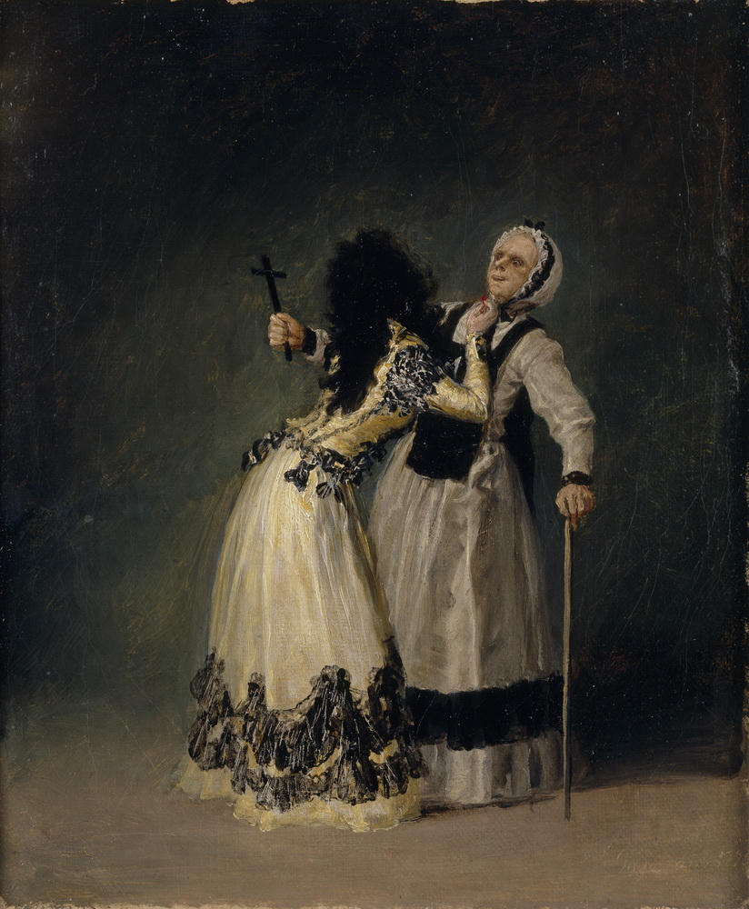

```
HISTORY OF MODERN ART
PAINTING SCULPTURE ARCHITECTURE PHOTOGRAPHY
SEVENTH EDITION

H.H.Arnason,Elizabeth_C.Mansfield
MolyChin 编译
Modern Art-004
```


The French Romantic movement really came into its own with Eugène Delacroix (1798–1863)—through his exploration of exotic themes, his accent on violent movement and intense emotion, and, above all, through his reassertion of Baroque color and emancipated brushwork (fig. 1.8). He brought the same qualities to more conventional subjects drawn from literature and history. Not surprisingly, Delacroix felt drawn to scenes taken from Shakespeare,whose characters often succumb to their passions for power or love. Delacroix’s intensive study of the nature and capabilities of color derived not only from the Baroque but also from his contact with English painters such as John Constable, Richard Bonington, and Joseph Mallord William Turner. His greatest originality, however, may lie less in the freedom and breadth of his touch than in the way he juxtaposed colors in blocks of mutually intensifying complementaries, such as vermilion and blue-green or violet and gold, arranged in large sonorous chords or, sometimes, in small, independent, “divided” strokes. These  techniques and their effects had a profound influence on the Impressionists and Post-Impressionists, particularly Vincent van Gogh (who made several copies after Delacroix) and Paul Cézanne.

法国浪漫主义运动真正与尤格内德拉克洛瓦（1798-1863）形成了自己的风格——通过他对异域主题的探索，他对暴力运动和强烈情感的强调，最重要的是，通过他对巴洛克色彩和解放笔法的重新坚持（图1.8）。他把同样的品质带到了更传统的文学和历史学科上。毫不奇怪，德拉克洛瓦对莎士比亚的场景很感兴趣，莎士比亚的人物常常屈服于他们对权力或爱情的激情。德拉克洛瓦对色彩的本质和能力的深入研究不仅源于巴洛克风格，还源于他与英国画家如约翰·康斯特布尔、理查德·邦宁顿和约瑟夫·马洛德·威廉·特纳的接触。然而，他最伟大的创意可能在于他触摸的自由和广度，而不是他把颜色放在一块块相互加强的互补物上，如朱砂、蓝绿色、紫罗兰色和金色，排列成大而响亮的和弦，有时是小而独立的“分裂”笔画。这些技术及其影响对印象派和后印象派有着深远的影响，特别是文森特·梵高（在德拉克洛瓦之后复制了几本）和保罗·C·赞恩。

---
法国浪漫主义运动真正与EugèneDelacroix（1798-1863）结合在一起 - 通过他对异国主题的探索，他对暴力运动和强烈情感的重视，以及最重要的是，通过重新演绎巴洛克色彩和解放的笔触（无花果） 1.8）。他为文学和历史中更传统的主题带来了同样的品质。毫不奇怪，德拉克洛瓦对莎士比亚拍摄的场景很感兴趣，他们的角色经常屈服于他们对权力或爱情的激情。德拉克洛瓦对色彩的本质和能力的深入研究不仅来自巴洛克，还来自他与英国画家如John Constable，Richard Bonington和Joseph Mallord William Turner的联系。然而，他最大的创意可能不在于他的触摸的自由和广度，而在于他将颜色并置在相互增强的互补性中，例如朱红色和蓝绿色或紫色和金色，以大铿锵的和弦排列，或者，有时，在小的，独立的，“分开的”笔画中。这些技巧及其影响对印象派和后印象派有深远的影响，特别是文森特梵高（在德拉克洛瓦之后制作了几本）和保罗塞尚。

Landscape Painting
Fascinated with the awesome power of nature, Romantic artists were, not surprisingly, drawn to the genre of landscape painting. For some painters, the landscape offered a manifestation of the sublime, the rational workings of a deity; for others, a symbol of humanity’s helplessness in the face of an irrational fate. Either way, the landscape served as a forceful vehicle for Romantic meditations on the limits of human understanding and the fragility of civilization. Landscape paintings were also much sought after by early nineteenthcentury patrons, who could accommodate scenes of familiar as well as distant lands in their homes more easily than they could hang large-scale history paintings depicting arcane subjects from classical texts.
Although the main lines of twentieth-century painting are traditionally traced to French art, Romantic treatments of the landscape found their most characteristic manifestation in Germany. Indeed, there were critical contemporary developments in Germany, England, Scandinavia, and the Low Countries throughout much of the nineteenth century. One may, in fact, trace an almost unbroken Romantic tradition in Germany and Scandinavia—a legacy that extends from the late eighteenth century through the entire nineteenth century to Edvard Munch, the Norwegian forerunner of Expressionism, and the later German artists who admired him. Implicit in this Romantic vision is a sense that the natural world can communicate spiritual and cultural values, at times formally religious, at times broadly pantheistic.
Although landscape painting in France during the early nineteenth century was a relatively minor genre, by midcentury certain close connections with the English landscapists of the period began to have crucial effects. The painter Richard Parkes Bonington (1802–28), known chiefly for his watercolors, lived most of his brief life in France, where, for a short time, he shared a studio with his friend Delacroix.
山水画

浪漫主义艺术家对大自然的神奇力量着迷，毫不奇怪地被山水画所吸引。对一些画家来说，这幅风景展现了神灵的崇高、理性的运作；对其他人来说，它象征着人类面对非理性命运时的无助。无论哪种方式，景观都是人类理解极限和文明脆弱性的浪漫冥想的有力工具。风景画也受到了十九世纪初的赞助人的追捧，他们可以更容易地在家中容纳熟悉和遥远的土地，而不是悬挂大型历史画，描绘古典文本中的神秘主题。

尽管20世纪绘画的主要线条传统上可追溯到法国艺术，但对风景的浪漫处理在德国最具特色。事实上，在整个19世纪的大部分时间里，德国、英国、斯堪的纳维亚和低收入国家都发生了重大的当代发展。事实上，人们可以追溯到德国和斯堪的纳维亚几乎未被打破的浪漫传统，这一传统从18世纪末一直延续到整个19世纪，一直延续到挪威表现主义先驱埃德瓦尔德蒙奇，以及后来钦佩他的德国艺术家。在这种浪漫的视野中，隐含着一种感觉，即自然世界可以传达精神和文化价值，有时正式的宗教，有时广泛的泛神论。

尽管十九世纪初法国的风景画是一种相对次要的类型，但到了本世纪中叶，与当时的英国景观学家的某些密切联系开始产生了至关重要的影响。画家理查德帕克斯邦宁顿（1802-28），主要以水彩画闻名，他在法国度过了他短暂的一生，在那里，他与他的朋友德拉克罗瓦共享了一个工作室。
---
山水画
着迷于大自然的强大力量，浪漫的艺术家，毫不奇怪，被吸引到山水画的流派。对于一些画家来说，景观提供了崇高的表现，一个神的理性运作;对于其他人来说，这是人类在非理性命运面前无助的象征。无论哪种方式，景观都成为浪漫冥想的有力载体，在人类理解的极限和文明的脆弱性。十九世纪早期的赞助人也非常喜欢山水画，他们可以更容易地在他们的家中容纳熟悉和遥远的土地，而不是挂起描绘古典文本中神秘主题的大型历史绘画。
尽管二十世纪绘画的主线传统上都追溯到法国艺术，但浪漫的景观处理在德国找到了最具特色的表现形式。事实上，在十九世纪的大部分时间里，德国，英国，斯堪的纳维亚和低地国家都有重要的当代发展。事实上，人们可以追溯到德国和斯堪的纳维亚半岛几乎不间断的浪漫主义传统 - 这一传统从十八世纪后期到整个十九世纪延伸到挪威表现主义先驱爱德华蒙克以及后来钦佩他的德国艺术家。在这个浪漫主义的视野中隐含着一种感觉，即自然世界可以传达精神和文化价值，有时是正式的宗教信仰，有时广泛泛神论。
虽然十九世纪早期法国的山水画是一种相对较小的类型，但到了中世纪，与这一时期的英国景观主义者的某些密切联系开始产生了至关重要的影响。画家理查德·帕克斯·波宁顿（1802-28）主要以他的水彩画而闻名，他的大部分时间都生活在法国，在那里，他与朋友德拉克罗瓦共享了一个工作室。

Bonington’s direct studies from nature exerted considerable influence on several artists of the Romantic school,including Delacroix, as well as landscape painters associated with the Barbizon School, which will be discussed below.
Although he painted cityscapes as well as genre and historical subjects, it was the spectacular effects of Bonington’s luminous marine landscapes (fig. 1.9) that directly affected artists such as Johan Barthold Jongkind and Eugène Boudin, both important precursors of Impressionism (see fig. 2.27).
Indeed, many of the English landscapists visited France and exhibited in the Paris Salons, while Delacroix spent time in England and learned from the direct nature studies of the English artists. Foremost among these were John Constable (1776–1837) and Joseph Mallord William Turner (1775–1851). Constable spent a lifetime recording in paint those locales in the English countryside with which he was intimately familiar (fig. 1.10). The exhibition of several of his works, including his The Hay Wain, at the Paris Salon of 1824 brought him greater acclaim in France than he received in Britain. Delacroix, in particular, took to heart Constable’s evocative brushwork and personal engagement with nature.
Though his paintings and the sketches he made from nature were the product of intensely felt emotion, Constable never favored the dramatic historical landscapes, with their sublime vision of nature, for which Turner was justifiably famous in his own day. Ambitious, prolific, and equipped with virtuosi technical skills, Turner was determined to make landscapes in the grand tradition of Claude Lorrain and Poussin, whose carefully constructed, Italianate landscapes defined classical landscape painting for over two centuries.
Bonington对自然的直接研究对浪漫派的几位艺术家，包括Delacroix，以及与巴比松派有关的风景画家产生了相当大的影响，这将在下面讨论。

尽管他绘制了城市景观以及流派和历史主题，但波宁顿明亮的海洋景观（图1.9）的壮观效果直接影响了艺术家，如约翰巴特霍德琼金德和尤格布丁，这两个都是印象主义的重要先驱（见图2.27）。

事实上，许多英国景观学家参观了法国，并在巴黎沙龙展出，而德拉克罗瓦则在英国度过了一段时间，并从英国艺术家的直接自然研究中学习。其中最重要的是约翰·康斯特布尔（1776-1837）和约瑟夫·马洛德·威廉·特纳（1775-1851）。康斯特布尔花了一生的时间在英国乡村的那些他非常熟悉的地方画画（图1.10）。1824年，他在巴黎沙龙上展出了几幅作品，其中包括他的《海因》，这使他在法国获得了比英国更大的赞誉。尤其是德拉克洛瓦，将康斯特布尔令人回味的笔法和与自然的个人接触铭记于心。

尽管康斯特布尔的绘画和他从自然中创作的素描是强烈情感的产物，但康斯特布尔从不喜欢戏剧化的历史景观，因为它们具有崇高的自然观，而特纳在他自己的时代就因这一点而出名。特纳雄心勃勃，多产，并配备了精湛的技术，他决心使景观在克劳德洛伦和普桑的伟大传统，精心建造，意大利的景观定义了古典景观绘画超过两个世纪。
---
Bonington对大自然的直接研究对浪漫派的几位艺术家产生了相当大的影响，包括Delacroix，以及与Barbizon学校相关的风景画家，将在下面讨论。
虽然他画的是都市风景以及流派和历史题材，但是Bonington的明亮海洋景观（图1.9）的壮观效果直接影响了艺术家，如Johan Barthold Jongkind和EugèneBoudin，这两者都是印象派的重要先驱（见图2.27）。 ）。
事实上，许多英国风景画家访问了法国，并在巴黎沙龙展出，而德拉克洛瓦则在英国度过了一段时间，并从英国艺术家的直接自然研究中学习。其中最重要的是John Constable（1776-1837）和Joseph Mallord William Turner（1775-1851）。康斯特布尔在英国乡村的油漆区度过了一生的记录，他非常熟悉这些地方（图1.10）。他在1824年的巴黎沙龙上展出了他的几部作品，包括他的The Hay Wain，这使他在法国获得了比在英国获得的更多赞誉。特别是德拉克洛瓦（Delacroix），让康斯特布尔（Constable）充满了令人回味的笔触和与自然的个人接触。
虽然他的画作和他用大自然制作的素描是强烈感受到的情感的产物，但是康斯特布尔从不喜欢戏剧性的历史景观，他们崇高的自然景观，特纳在他自己的时代是有道理的。 Turner雄心勃勃，多产，并配备了高超的技术技能，他决心在Claude Lorrain和Poussin的传统中制作风景画，其精心构造的意大利风景画定义了两个多世纪的古典山水画。


Though both were French, each decided to pursue painting in the campagna, or countryside around Rome. Turner’s first trip to Italy in 1819 was an experience with profound consequences for his art. In his watercolors and oils he explored his fascination with the often destructive forces of nature and the ever-changing conditions of light and atmosphere in the landscape. His dazzling light effects could include the delicate reflections of twilight on the Venetian canals or a dramatic view across the Thames of the Houses of Parliament in flames (fig. 1.11). Turner’s painterly style could sometimes verge on the abstract, and his paintings are especially relevant to developments in twentieth-century art.
The degree to which Turner’s subjective exploration of nature led him toward abstraction did not deter John Ruskin from heralding the painter as the most significant of “modern” artists. Viewers looking today at Turner’s The Burning of the Houses of Parliament alongside Whistler’s Nocturne in Black and Gold might wonder at Ruskin’s rejection of the latter. Like Turner, Whistler gives the majority of his canvas to the striking play of light and color against the sky. Both painters appeal to technical experimentation to achieve the dramatic incendiary effects at the center of their paintings. One place where the two differ, however, is in their handling of space. Turner remains true to the classical construction of pictorial space as divided into a clearly discernible fore-, middle-, and background. Despite its violent subject, his painting retains the balance and symmetry characteristic of classical works by Claude and Poussin. Whistler, on the other hand, abandons these conventions, plunging the viewer into an uncertain position vis-à-vis the flash of fireworks and their reflection on the surface of the river.
尽管两人都是法国人，但他们都决定去坎帕尼亚（Campagna）或罗马周边的乡村进行绘画。特纳1819年第一次到意大利旅行，对他的艺术产生了深远的影响。在他的水彩画和油画中，他探索了自己对自然的破坏力的迷恋，以及风景中不断变化的光和大气条件。他令人眼花缭乱的灯光效果可能包括威尼斯运河上微弱的暮光反射，或是国会大厦的泰晤士河大火中的戏剧性景象（图1.11）。特纳的绘画风格有时近乎抽象，他的绘画与20世纪艺术的发展尤为相关。

特纳对自然的主观探索使他走向抽象的程度，并没有阻止约翰·罗斯金将画家称为“现代”艺术家中最重要的一位。今天观看特纳的《烧毁议会大厦》和惠斯勒的《黑色和金色夜曲》的观众可能会对罗斯金对后者的拒绝感到好奇。像特纳一样，惠斯勒把他的画布的大部分赋予了天空中光影和色彩的引人注目的效果。两位画家都呼吁进行技术实验，以在他们的画的中心达到戏剧性的燃烧效果。然而，有一个地方两者不同，那就是它们对空间的处理。特纳仍然忠实于绘画空间的经典结构，将其分为清晰可辨的前视、中视和背景。尽管主题暴力，他的绘画仍保持着克劳德和普桑古典作品的平衡和对称特征。另一方面，惠斯勒摒弃了这些习俗，将观看者置于一个不确定的位置，看烟花的闪光和它们在河表面的反射。
---
虽然两人都是法国人，但每个人都决定在坎帕纳（campagna）或罗马周围的乡村进行绘画。特纳1819年首次访问意大利是一次对他的艺术产生深远影响的经历。在他的水彩画和油画中，他探索了他对自然界经常具有破坏性的力量以及景观中不断变化的光线和大气条件的迷恋。他令人眼花缭乱的灯光效果可能包括威尼斯运河上暮色的微妙反射，或火焰中议会大厦泰晤士河的戏剧性景观（图1.11）。特纳的绘画风格有时可能会抽象，他的画作与二十世纪艺术的发展特别相关。
特纳对自然的主观探索使他走向抽象的程度并没有阻止约翰拉斯金宣称画家是最重要的“现代”艺术家。今天观看特纳的议会之家和惠斯勒的黑夜金色夜曲的观众可能会想到拉斯金对后者的拒绝。和特纳一样，惠斯勒将他的大部分画布都放在了对着天空的光线和色彩上。两位画家都希望通过技术实验来在他们的绘画中心实现戏剧性的燃烧效果。然而，两者不同的一个地方是处理空间。特纳仍然忠于图像空间的经典建构，分为清晰可辨的前，中，背景。尽管它的主题是暴力主题，但他的绘画仍然保留了克劳德和普桑古典作品的平衡和对称特征。另一方面，惠斯勒放弃了这些惯例，使观众陷入不确定的位置，相对于烟花的闪光及其在河面上的反射。


What is more, Whistler’s subject—the regular fireworks display over an amusement park popular among the working as well as middle classes—evokes the cheap and artificial pleasures of urban life. Turner’s work instead conveys the awesomeness of nature—here, represented by the fire—which threatens to destroy a consummate symbol of civilization.
The principal French Romantic landscape movement was the Barbizon School, a loose group named for a village in the heart of the forest of Fontainebleau, southeast of Paris. The painters who went there to work drew from the seventeenth-century Dutch landscape tradition as well as that of England. Works by Bonington and Constable rather than Turner, however, had the greatest influence on the Barbizon painters. Thus, the emphasis continued to be on unified, tonal painting rather than on free and direct color.
It was the interior of the forest of Fontainebleau, rather than the brilliant sunlight of the seashore, that appealed to them. This in itself could be considered a Romantic interpretation of nature, as the expression of intangibles through effects of atmosphere.
Among the artists most closely associated with the Romantic landscape of the Barbizon School was Théodore Rousseau (1812–67). Instead of following the classical approach by visiting Italy and painting an idealized version of the campagna, Rousseau deliberately turned to the French landscape for his subjects. What is more, he refused to endow his landscapes with mythological or other narrative scenes. He painted pure landscapes, believing that nature itself provided more than sufficient thematic content. In the forests around Fontainebleau Rousseau distilled the essence of French culture and nationality; not surprisingly, the period of his greatest popularity coincided with the establishment of France’s brief Second Republic (1848–52). In his Edge of the Forest of Fontainebleau, Sunset (fig. 1.12),Rousseau endows the scene with great intimacy by framing the view with trees that appear to bow as if acknowledging the presence of the viewer. The vegetation—especially the lone, backlit tree in the middle ground—seems more animated, more alive than even the cattle who staff the scene.
更重要的是，惠斯勒的主题——经常在一个游乐场上燃放烟花，在工人阶级和中产阶级中广受欢迎，这唤起了城市生活中廉价和人为的乐趣。相反，特纳的作品传达了这里大自然的敬畏之情，以火焰为代表，它威胁着摧毁一个完美的文明象征。

法国主要的浪漫主义景观运动是巴比松学校，一个以巴黎东南方枫丹白露森林中心的一个村庄命名的松散团体。去那里工作的画家借鉴了17世纪荷兰和英国的风景传统。然而，由邦宁顿和康斯特布尔而不是特纳创作的作品对巴比松画家的影响最大。因此，重点继续放在统一的色调绘画上，而不是放在自由直接的色彩上。

吸引他们的是枫丹白露森林的内部，而不是海滨的灿烂阳光。这本身可以被视为一种对自然的浪漫诠释，通过大气的影响来表达无形的东西。

与巴比松学派的浪漫风景最为密切相关的艺术家之一是卢梭（1812-167）。卢梭没有按照古典主义的方式去意大利，而是画了一幅理想化的坎帕尼亚画卷，而是特意转向法国风景画作为他的主题。更重要的是，他拒绝赋予他的景观神话或其他叙事场景。他画了纯粹的风景画，认为自然本身提供了足够的主题内容。卢梭在枫丹白露周围的森林中提炼出了法国文化和民族的精髓；毫不奇怪，他最受欢迎的时期恰逢法国短暂的第二共和国（1848-52）的建立。在枫丹白露森林的边缘，日落（图1.12），卢梭通过用看起来像是在承认观看者的存在的树来构图，赋予了场景极大的亲密感。中间的植被，尤其是孤零零的背光树，看起来更生动，甚至比牛群中的工作人员更有活力。
---
更重要的是，惠斯勒的主题 - 在工作和中产阶级中流行的游乐园上的定期烟花表演 - 唤起了城市生活的廉价和人造的乐趣。特纳的工作反而传达了大自然的可怕性 - 在这里，以火为代表 - 这有可能摧毁一个完美的文明象征。
主要的法国浪漫主义景观运动是巴比松学校，这是一个松散的群体，以巴黎东南部枫丹白露森林中心的一个村庄命名。去那里工作的画家们来自十七世纪的荷兰风景传统以及英格兰的风景传统。然而，波宁顿和康斯特布尔而不是特纳的作品对巴比松画家的影响最大。因此，重点仍然是统一的色调绘画，而不是自由和直接的色彩。
正是枫丹白露森林的内部，而不是海滨的灿烂阳光，吸引着他们。这本身可以被视为对自然的浪漫诠释，通过大气的影响表达无形资产。
与巴比松学校浪漫主义风景最密切相关的艺术家是ThéodoreRousseau（1812-67）。卢梭不是通过访问意大利和绘制一个理想化的坎帕尼亚版本来遵循经典方法，而是故意转向法国景观为他的主题。更重要的是，他拒绝用神话或其他叙事场景赋予他的风景。他画的是纯净的风景画，他们相信大自然本身提供了足够的主题内容。在枫丹白露森林周围的森林中，提升了法国文化和民族的精髓;毫不奇怪，他最大受欢迎的时期恰逢法国短暂的第二共和国（1848-52）的成立。在他的枫丹白露森林边缘，日落（图1.12），卢梭赋予景象极大的亲密感，用树木构筑视野，看起来像是在承认观众的存在。植被 - 尤其是中间地带唯一的背光树 - 看起来更加生动，甚至比现场工作的牛还活着。

Other painters associated with the Barbizon School depended instead on a more literal human presence in order to animate their landscapes. Jean-François Millet (1814–75) peopled his landscapes with laborers, often treating them with a grandeur customarily reserved for biblical or classical heroes (fig. 1.13). As if to redeem the grinding poverty of unpropertied farm life, he integrated his field laborers into landscape compositions of Poussinesque grandeur and calm. Because of this reverence for peasant subjects Millet exerted great influence on Van Gogh (see Chapter 3).
In the end, both Neoclassicism and Romanticism (and,ultimately, modernism) can be seen as products of the Enlightenment. The eighteenth-century valorization of rationality, the faith in reason exhibited by such philosophes as Voltaire and Denis Diderot, undergirds the Neoclassical penchant for archeological accuracy, pictorial clarity, and even moral virtue. Through reason, the social as well as the natural order can be understood and, perhaps, even improved. Hence, rigorous academic training with its years of practice and emulation offered the most reliable guide to young painters. Yet, the Enlightenment had another face, a face that turned toward the emotional side of life. The philosophe Jean-Jacques Rousseau argued that natural, unpolluted human emotions offered the surest means of understanding truth. For Rousseau, only by feeling something could one truly know it. This strand of the Enlightenment finds itself at the center of Romanticism, where truth is sought by turning inward, where subjective experiences are the surest markers of genius. Just as, for Rousseau, conventional schools offered only corruption and lies, academic practices struck some Romantic artists as similarly contrary to their aims.
It can fairly be said, however, that both Neoclassicism and Romanticism nourish the roots of modernism. In fact, modernism might be best understood as a struggle between the forces of objective rationality and subjective expression. At certain points in the history of modern art,one or the other might seem to gain the advantage. But the tension between the two continues to exert its influence,and the other side is never far from revealing itself. This condition makes itself felt early in the nineteenth century with the appearance of another artistic mode of representation that contributed to the evolution of modernism:
Realism. A literary as well as visual style, Realism pushed the Enlightenment penchant for dispassionate rationality and social improvement to its zenith.
其他与巴比松学派有关的画家则依靠一种更真实的人类存在来创造他们的风景。Jean-Fran_ois Millet（1814-1815）把他的风景画交给了劳工，经常以一种通常为圣经或古典英雄保留的宏伟气势来对待它们（图1.13）。仿佛是为了弥补无家可归的农场生活的贫乏，他把自己的农场工人融入到了波桑式壮丽和宁静的景观作品中。由于对农民的崇敬，谷子对梵高产生了巨大的影响（见第3章）。

最后，新古典主义和浪漫主义（以及最终的现代主义）都可以看作是启蒙运动的产物。18世纪理性的价值化，伏尔泰和丹尼斯·狄德罗等哲学家所表现出的对理性的信仰，为新古典主义对考古学准确性、画法清晰性甚至道德美德的倾向提供了基础。通过理性，社会秩序和自然秩序都可以被理解，甚至可能得到改善。因此，通过多年的实践和模仿，严格的学术培训为年轻画家提供了最可靠的指导。然而，启蒙运动还有另一张脸，一张转向生活情感方面的脸。哲学家让·雅克·卢梭认为，自然的、没有污染的人类情感提供了最可靠的理解真理的手段。对卢梭来说，只有通过感觉才能真正了解它。启蒙运动的这一部分发现自己处于浪漫主义的中心，在那里通过向内寻求真理，在那里主观经验是天才最可靠的标志。正如对卢梭而言，传统的学校只提供腐败和谎言一样，学术实践对一些浪漫主义艺术家来说也同样违背了他们的目标。

可以说，新古典主义和浪漫主义都是现代主义的根源。事实上，现代主义最好理解为客观理性与主观表达之间的斗争。在现代艺术史上的某些时刻，一个或另一个似乎获得了优势。但两者之间的紧张关系仍在继续发挥其影响，而另一方也从未远离表露自己。这种情况在19世纪早期，随着另一种艺术表现方式的出现，使自己感觉到，这种艺术表现方式促成了现代主义的发展：

现实主义。现实主义是一种文学形式和视觉形式，它将启蒙运动对冷静理性和社会进步的追求推向了顶峰。
---
与巴比松学校相关的其他画家依赖于更加文字化的人类存在，以便为他们的景观制作动画。让 - 弗朗索瓦·米勒（Jean-FrançoisMillet，1814-75）将他的景观与劳动者联系起来，经常用一种通常用于圣经或古典英雄的宏伟对待他们（图1.13）。似乎为了挽回无人农场生活的贫困，他将他的野外工人融入了Poussinesque宏伟和平静的景观构成中。由于对农民主体的崇敬，米勒对梵高产生了很大的影响（见第3章）。
最后，新古典主义和浪漫主义（以及最终的现代主义）都可以被视为启蒙运动的产物。十八世纪理性的价值观，伏尔泰和丹尼斯狄德罗等哲学家对理性的信仰，巩固了新古典主义对考古准确性，图像清晰度，甚至道德美德的偏爱。通过理性，社会和自然秩序可以被理解，甚至可以改进。因此，通过多年的实践和模拟，严格的学术培训为年轻画家提供了最可靠的指导。然而，启蒙运动有另一张脸，一张面向生活情感方面的脸。哲学家让 - 雅克·卢梭（Jean-Jacques Rousseau）认为，自然，未受污染的人类情感提供了理解真理的最可靠方法。对于卢梭来说，只有通过感受才能真正了解它。启蒙运动的这一部分发现自己处于浪漫主义的中心，在这里，通过内向转向寻求真理，主观经验是天才的最可靠标志。就像卢梭一样，传统学校只提供腐败和谎言，学术实践使一些浪漫主义艺术家同样违背他们的目标。
然而，可以公平地说，新古典主义和浪漫主义都滋养了现代主义的根源。事实上，现代主义可能最好被理解为客观理性和主观表达力量之间的斗争。在现代艺术史上的某些方面，一个或另一个似乎可以获得优势。但是，两者之间的紧张关系继续发挥其影响力，而另一方面却从不透露自己。这种情况在十九世纪早期就出现了，其另一种艺术表现形式的出现促成了现代主义的发展：
现实主义。作为一种文学和视觉风格，现实主义将启蒙运动倾向于冷静理性和社会进步的顶峰。


||
|:---:|
|戈雅，The Duchess of Alba and Her Duenna|

||
|:---:|
||


>continue......
