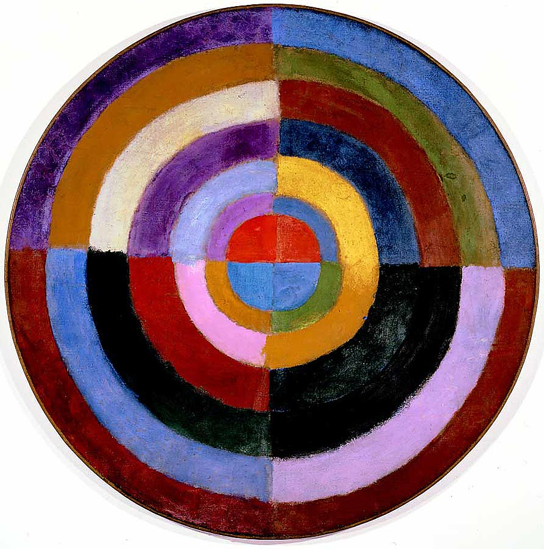

```
Created on  2019.05.27.23:35  
抽象艺术 编译：Moly Chin
@author: molychin@qq.com
```

抽象艺术是指任何 **对真实自然物象的描绘予以简化或完全抽离的艺术**，它的美感内容借由 **形体、线条、色彩的形式组合或结构** 来表现。有时抽象艺术的主题是真实存在的，但由于 **过分风格化、模糊化、重叠覆盖或分解至基本的形式，以至于难以辨认原貌**。用此种方式将主题局部分解，称之为半抽象艺术（semiabstract）；而彻底将真实物体抛弃，则称之为非写实艺术（nonrepresentational）或非具象（NONOBJECTIVE）艺术。瓦西里·康定斯基（Wassily Kandinsky，1866－1944）率先使用了这个词语，他作于1910年的一张水彩画被某些权威学者认定为第一件属于完全意义上的抽象绘画作品。从新石器时代迄今，显现于艺术品或装饰艺术中的抽象元素或抽象倾向，贯穿了整个艺术史。但抽象风格成为一种审美准则，却是到了20世纪初期由巴勃罗·毕加索（Pablo Picasso，1881—1973）乔治·勃拉克（Georges Braque，1882—1963）领导的立体主义运动（cubism）发展之后才开始。抽象艺术在早期发展的重要阶段，尚有其他出现在荷兰的新造型主义（NEOPLASTICISM）和俄国的至上主义 。

抽象艺术（抽象画）的定义

抽象艺术（抽象画）定义：非具象、非理性的纯粹视觉形式。
　　有三个内涵：
　　首先：抽象画作品中不描绘、不表现现实世界的客观形象，也不反映现实生活；
　　其次：没有绘画主题，无逻辑故事和理性诠释，既不表达思想也不传递个人情绪；
　　第三：纯粹由颜色、点、线、面、肌理、构成、组合的视觉形式


抽象艺术特征
抽象艺术是无主题无逻辑无故事的艺术，是经验之外的生命感受，是通过抽象的色彩、线条、色块、构成来表达和叙述人性的艺术方式。
　　抽象艺术追求独创性，并把创新作为唯一的艺术。抽象艺术要挑战经验与世界，创造出前所未有的新美图画。
　　我们常常会觉得抽象艺术的不可接受与不可理喻，会感叹抽象艺术作品惊人的陌生和晦涩。其实，这一切只是经验与想象的矛盾所致。要知道艺术并不是具体的物质展示，而是抽象的感觉过程，是主观意识的活动。抽象艺术的独创性，给我们主观意识以最大的活动空间，感受艺术才能成为最美好的享受。
　　抽象艺术注重形式更甚于注意内容。形式可以千变万化，可以柳暗花明。抽象绘画还特别强调绘画语言的单纯性，即绘画形式的纯粹性，不带任何经验的构想。不模仿任何已有的创造，刻意在视觉空间，创造出独特的绘画语言，以鲜明的个性及艺术符号来完成画家对艺术的生命体验。


抽象艺术的概念

在很多时候，抽象艺术的概念指的就是抽象画。当然，除了抽象画以外，抽象艺术还应该包括更多的艺术领域、抽象雕塑、抽象装置、音乐、抽象诗歌、抽象摄影、建筑、抽象舞蹈等。
　　 抽象是外来语。在艺术中的抽象最初只是对具象的概括和提炼，使得画面消解了具体的轮廓和细节，变得高度象征性。我们可以从毕加索的《牛》和蒙德里安的《树》的演变来理解西方人的抽象概念最初的含义。后来，抽象走向了极端，彻底摆脱了具体的形象和物象，画面必须没有任何我们的视觉所熟悉的物体，纯粹由色彩、构成、符号、点线面、肌理构成的画面，才称为抽象画。


马松 (1896-1987年) [1]  安德列·马松出生于法国瓦兹省巴拉尼村，早年在布鲁塞尔求学，并在巴黎美术学校学习。年轻时代受到立体派和超现实主义画家的影响，特别是受到卡夫卡和布莱克的思想冲击，他的创作主题转向情欲的梦幻和把自然真实加以变形，成为杰出的超现实主义画家。他的画像迷宫一样，用色块、线条和形状构成纷繁多趣的画面。

2.抽象表现主义两大支系
行动绘画：以流淌的笔触或泼洒的颜料来构成画面，形象以线性为主，具有强力特质，绘画动作即兴、高度依赖本能与冲动。(随机性、自发性—自然性、自在性共存)
色域绘画：以色彩填充为手段，以分割画面区域的方式构图，形象以面性为主，气质沉着宁静，宗教观念和神秘主义常参与其中。


一定形状的物体外在表现出来的样式（色彩、线条、形体等）就是形式。形式美是指大千世界中各种形式因素及其规律的组合所呈现出来的审美特性，它是人类创造美的过程中关于事物外在形式规律的总结。

基调是指基本调性或主要运动方向及形态特征。
节奏韵律：节奏通常表现为一些形态元素有条理的反复、交替或排列。韵律是指按照美学要求而产生的由元素与元素之间有节奏的连续进行或流动。
变化
对比与秩序：对比就是用各种手段使要素之间产生紧张和冲突的一种视觉效果。
单纯

形式美法则的特点
抽象性：指各种个别美的形式中能够抽象出某种富有美感的共同形式特征。这种特征以抽象的形式存在。

“抽象艺术真可称得上是20世纪典型的艺术样式了，可是没有人敢断言它属于通俗艺术的样式。对于广大民众来说，它仍像喜马拉雅一样高远，无从探测，不可理解。”抽象艺术在西方世界命运尚且如此，在中国它的位置就更加边缘了。


抽象艺术是指那些不依托于客观自然形态，而以独立的形状和色彩进行的创作。主要区别于逼真模仿自然形态进行创作的写实艺术，以及以可辨识的自然形态为依托进行创作的具象艺术。

抽象艺术的产生，可以说源自对逼真模仿自然的写实绘画的拒绝。

他们推崇儿童美术和原始艺术。康定斯基感兴趣的不是绘画技巧而是创作一种精神产品。

数学家舍恩-马尔克斯的观念是，通过一种思想的集中过程建立一种理解宇宙运动方式的普遍原则。蒙德里安追随这种理念，超越（毕加索为代表的）前抽象主义时期借用客体隐喻的工作方法，创立了几何化的纯抽象艺术，他想借此重构世界而非表现自我。

欧普艺术又称视网膜艺术，它利用一种繁复有规律的组织结构产生视错觉，冲击观众的视网膜。


维基百科


Robert Delaunay, 1912–13, Le Premier Disque, 134 cm (52.7 in.), Private collection.

Abstract art uses a visual language of shape, form, color and line to create a composition which may exist with a degree of independence from visual references in the world.Western art had been, from the Renaissance up to the middle of the 19th century, underpinned by the logic of perspective and an attempt to reproduce an illusion of visible reality. The arts of cultures other than the European had become accessible and showed alternative ways of describing visual experience to the artist. By the end of the 19th century many artists felt a need to create a new kind of art which would encompass the fundamental changes taking place in technology, science and philosophy. The sources from which individual artists drew their theoretical arguments were diverse, and reflected the social and intellectual preoccupations in all areas of Western culture at that time.
Abstract art, non-figurative art, non-objective art, and nonrepresentational art are loosely related terms. They are similar, but perhaps not of identical meaning.

抽象艺术使用形状、形式、颜色和线条的视觉语言来创作一种作品，这种作品可能在一定程度上独立于世界上的视觉参考文献。西方艺术从文艺复兴到19世纪中叶，一直受到透视逻辑的支持，并试图再现视觉错觉。欧洲以外的文化艺术已经变得容易接近，并向艺术家展示了描述视觉体验的其他方式。到19世纪末，许多艺术家感到有必要创造一种新的艺术，它将包括技术、科学和哲学发生的根本性变化。个体艺术家提出理论论据的来源是多种多样的，反映了当时西方文化所有领域的社会和知识关注。
抽象艺术，非具象艺术，非客观艺术和非代表性艺术是松散相关的术语。它们相似，但可能没有相同的含义。

Abstraction indicates a departure from reality in depiction of imagery in art. This departure from accurate representation can be slight, partial, or complete. Abstraction exists along a continuum. Even art that aims for verisimilitude of the highest degree can be said to be abstract, at least theoretically, since perfect representation is likely to be exceedingly elusive. Artwork which takes liberties, altering for instance color and form in ways that are conspicuous, can be said to be partially abstract. Total abstraction bears no trace of any reference to anything recognizable. In geometric abstraction, for instance, one is unlikely to find references to naturalistic entities. Figurative art and total abstraction are almost mutually exclusive. But figurative and representational (or realistic) art often contains partial abstraction.
Both geometric abstraction and lyrical abstraction are often totally abstract. Among the very numerous art movements that embody partial abstraction would be for instance fauvism in which color is conspicuously and deliberately altered vis-a-vis reality, and cubism, which blatantly alters the forms of the real life entities depicted.

抽象表示艺术中对“意象”的描绘与现实的背离。这种与精确表示的背离可以是轻微的、部分的或完全的。抽象存在于连续统一体中。即使是最高程度的真实性的艺术也可以说是抽象的，至少在理论上，因为完美的表现可能是极其难以捉摸的。艺术作品的自由，例如改变颜色和形式的方式是明显的，可以说是部分抽象的。完全抽象没有任何关于任何可识别的东西的痕迹。例如，在几何抽象中，人们不太可能找到对自然实体的引用。形象艺术和完全抽象几乎是相互排斥的。但具象和现实主义艺术往往包含部分抽象。
几何抽象和抒情抽象通常都是完全抽象的。在众多体现部分抽象的艺术运动中，例如“野兽派”，其中色彩明显地、故意地改变了与现实的对比，立体派则公然改变了所描绘的现实生活实体的形式。

History
Abstraction in early art and many cultures
Much of the art of earlier cultures – signs and marks on pottery, textiles, and inscriptions and paintings on rock – was simple, geometric and linear forms which might have had a symbolic or decorative purpose. It is at this level of visual meaning that abstract art communicates.[citation needed] One can enjoy the beauty of Chinese calligraphy or Islamic calligraphy without being able to read it.
历史
早期艺术和许多文化中的抽象
早期文化中的许多艺术——陶器、纺织品上的符号和标记，岩石上的铭文和绘画——都是简单的几何和线性形式，可能具有象征性或装饰性的目的。正是在这种视觉意义上，抽象艺术才能传达出来。人们可以欣赏中国书法或伊斯兰书法的美丽，但却无法阅读。

In Chinese painting, abstraction can be traced to the Tang dynasty painter Wang Mo (王墨), who is credited to have invented the splashed-ink painting style. While none of his paintings remain, this style is clearly seen in some Song Dynasty Paintings. The Chan buddhist painter Liang Kai (梁楷, c. 1140–1210) applied the style to figure painting in his "Immortal in splashed ink" in which accurate representation is sacrificed to enhance spontaneity linked to the non-rational mind of the enlightened. A late Song painter named Yu Jian, adept to Tiantai buddhism, created a series of splashed ink landscapes that eventually inspired many Japanese zen painters. His paintings show heavily misty mountains in which the shapes of the objects are barely visible and extremely simplified. This type of painting was continued by Sesshu Toyo in his later years.

在中国画中，抽象可以追溯到唐代画家王墨（王墨），他被认为发明了泼墨绘画风格。虽然他的画都没有保留下来，但这种风格在一些宋代的画中很明显。禅宗画家梁凯（梁楷，约1140-1210）在他的《水墨神仙》中运用了人物画的风格，其中牺牲了准确的表现，以增强与启蒙者非理性思维相关的自发性。一位名叫于坚的宋末画家，擅长天台佛教，创造了一系列水墨山水，最终启发了许多日本禅宗画家。他的画展示了浓雾弥漫的山脉，在那里物体的形状几乎看不见，极其简洁。Sesshu Toyo晚年继续这种绘画。


Immortal in splashed ink, Liang Kai, China, 12th century

Another instance of abstraction in Chinese painting is seen in Zhu Derun's Cosmic Circle. On the left side of this painting is a pine tree in rocky soil, its branches laced with vines that extend in a disorderly manner to the right side of the painting in which a perfect circle (probably made with help of a compass) floats in the void. The painting is a reflection of the Daoist metaphysics in which chaos and reality are complementary stages of the regular course of nature. In Tokugawa Japan some zen monk-painters created Enso, a circle who represents the absolute enlightenment. Usually made in one spontaneous brush stroke, it became the paradigm of the minimalist aesthetic that guided part of the zen painting.

中国画中抽象的另一个例子是朱德润的宇宙圆。这幅画的左边是一棵在岩石土壤中的松树，枝条上插满了藤蔓，杂乱无章地延伸到画的右边，画中一个完美的圆圈（可能是借助罗盘而画成的）漂浮在空中。这幅画反映了道教形而上学，混沌与现实是自然规律过程的互补阶段。在日本德川幕府，一些禅宗画家创造了一个代表绝对启蒙的圆。通常在一个自发的笔触中制作，它成为极简主义美学的范例，引导了禅画的一部分。


19th century
Main articles: Romanticism, Impressionism, Post-Impressionism, and Expressionism
Three art movements which contributed to the development of abstract art were Romanticism, Impressionism and Expressionism. Artistic independence for artists was advanced during the 19th century. Patronage from the church diminished and private patronage from the public became more capable of providing a livelihood for artists.

十九世纪
主要文章：浪漫主义，印象主义，后印象主义，表现主义
促进抽象艺术发展的三个艺术运动是浪漫主义、印象主义和表现主义。19世纪，艺术家的艺术独立性得到了提高。来自教会的赞助减少了，来自公众的私人赞助变得更有能力为艺术家提供生计。

Three art movements which contributed to the development of abstract art were Romanticism, Impressionism and Expressionism. Artistic independence for artists was advanced during the 19th century. An objective interest in what is seen, can be discerned from the paintings of John Constable, J M W Turner, Camille Corot and from them to the Impressionists who continued the plein air painting of the Barbizon school.

Early intimations of a new art had been made by James McNeill Whistler who, in his painting Nocturne in Black and Gold: The falling Rocket, (1872), placed greater emphasis on visual sensation than the depiction of objects.

有助于抽象艺术发展的三种艺术运动是浪漫主义、印象主义和表现主义。19世纪，艺术家的艺术独立性得到了提高。从约翰·康斯特布尔、J·M·W·特纳、卡米尔·科洛特的画作，以及继续巴比松画派的普林空气画的印象派画家，都可以看出人们对所看到的事物的客观兴趣。
詹姆斯·麦克尼尔·惠斯勒（James McNeill Whistler）在其画作《黑色与金色的夜曲：坠落的火箭》（1872年）中，对视觉的重视超过了对物体的描绘。

促进抽象艺术发展的三种艺术运动是浪漫主义，印象主义和表现主义。 艺术家的艺术独立性在19世纪得到了发展。 从约翰·康斯特布尔，J·W·特纳，卡米尔·柯罗的画作中可以看出对所看到内容的客观兴趣，以及从他们到继续巴比松学校的空气画的印象派画家。

詹姆斯·麦克尼尔·惠斯勒（James McNeill Whistler）早期对新艺术进行了暗示，他的作品“黑与金的夜曲”（Nocturne in Black and Gold）：落下的火箭（1872），更强调视觉感受而不是对物体的描绘。

Expressionist painters explored the bold use of paint surface, drawing distortions and exaggerations, and intense color. Expressionists produced emotionally charged paintings that were reactions to and perceptions of contemporary experience; and reactions to Impressionism and other more conservative directions of late 19th-century painting. The Expressionists drastically changed the emphasis on subject matter in favor of the portrayal of psychological states of being. Although artists like Edvard Munch and James Ensor drew influences principally from the work of the Post-Impressionists they were instrumental to the advent of abstraction in the 20th century. Paul Cézanne had begun as an Impressionist but his aim – to make a logical construction of reality based on a view from a single point,[14] with modulated color in flat areas – became the basis of a new visual art, later to be developed into Cubism by Georges Braque and Pablo Picasso.

Additionally in the late 19th century in Eastern Europe mysticism and early modernist religious philosophy as expressed by theosophist Mme. Blavatsky had a profound impact on pioneer geometric artists like Hilma af Klint and Wassily Kandinsky. The mystical teaching of Georges Gurdjieff and P.D. Ouspensky also had an important influence on the early formations of the geometric abstract styles of Piet Mondrian and his colleagues in the early 20th century.[15]


Henri Matisse, The Yellow Curtain, 1915. With his Fauvistcolor and drawing Matisse comes very close to pure abstraction.
Additionally in the late 19th century in Eastern Europe mysticism and early modernist religious philosophy as expressed by theosophist Mme. Blavatsky had a profound impact on pioneer geometric artists like Wassily Kandinsky, and Hilma af Klint. The mystical teaching of Georges Gurdjieff and P.D. Ouspensky also had an important influence on the early formations of the geometric abstract styles of Piet Mondrian and his colleagues in the early 20th century.

20th century
Main articles: Western painting, Fauvism, and Cubism
Post Impressionism as practiced by Paul Gauguin, Georges Seurat, Vincent van Gogh and Paul Cézanne had an enormous impact on 20th-century art and led to the advent of 20th-century abstraction. The heritage of painters like Van Gogh, Cézanne, Gauguin, and Seurat was essential for the development of modern art. At the beginning of the 20th century Henri Matisse and several other young artists including the pre-cubist Georges Braque, André Derain, Raoul Dufy and Maurice de Vlaminck revolutionized the Paris art world with "wild", multi-colored, expressive landscapes and figure paintings that the critics called Fauvism. With his expressive use of color and his free and imaginative drawing Henri Matisse comes very close to pure abstraction in French Window at Collioure (1914),View of Notre-Dame (1914), and The Yellow Curtain from 1915. The raw language of color as developed by the Fauves directly influenced another pioneer of abstraction, Wassily Kandinsky (see illustration).
Although Cubism ultimately depends upon subject matter, it became, along with Fauvism, the art movement that directly opened the door to abstraction in the 20th century. Pablo Picasso made his first cubist paintings based on Cézanne's idea that all depiction of nature can be reduced to three solids: cube, sphereand cone. With the painting Les Demoiselles d'Avignon (1907), Picasso dramatically created a new and radical picture depicting a raw and primitive brothel scene with five prostitutes, violently painted women, reminiscent of African tribal masks and his own new Cubist inventions. Analytic cubism was jointly developed by Pablo Picasso and Georges Braque, from about 1908 through 1912. Analytic cubism, the first clear manifestation of cubism, was followed by Synthetic cubism, practiced by Braque, Picasso, Fernand Léger, Juan Gris, Albert Gleizes, Marcel Duchamp and others into the 1920s. Synthetic cubism is characterized by the introduction of different textures, surfaces, collage elements, papier collé and a large variety of merged subject matter. The collage artists like Kurt Schwitters and Man Ray and others taking the clue from Cubism were instrumental to the development of the movement called Dada.


František Kupka, Amorpha, Fugue en deux couleurs (Fugue in Two Colors), 1912, oil on canvas, 210 x 200 cm, Narodni Galerie, Prague. Published in Au Salon d'Automne "Les Indépendants" 1912, Exhibited at the 1912 Salon d'Automne, Paris.


Robert Delaunay, 1912, Windows Open Simultaneously (First Part, Third Motif), oil on canvas, 45.7 x 37.5 cm, Tate Modern
The Italian poet Marinetti published 'The Founding and Manifesto of Futurism' in 1909, which inspired artists such as Carlo Carra in Painting of Sounds, Noises and Smells and Umberto Boccioni Train in Motion, 1911, to a further stage of abstraction and profoundly influenced art movements throughout Europe.[11]
During the 1912 Salon de la Section d'Or the poet Guillaume Apollinaire named the work of several artists including Robert and Sonia Delaunay, Orphism.[12]He defined it as, the art of painting new structures out of elements that have not been borrowed from the visual sphere, but had been created entirely by the artist...it is a pure art.
Since the turn of the century, cultural connections between artists of the major European and American cities had become extremely active as they strove to create an art form equal to the high aspirations of modernism. Ideas were able to cross-fertilize by means of artist's books, exhibitions and manifestos so that many sources were open to experimentation and discussion, and formed a basis for a diversity of modes of abstraction. The following extract from,'The World Backwards', gives some impression of the inter-connectedness of culture at the time: 'David Burliuk's knowledge of modern art movements must have been extremely up-to-date, for the second Knave of Diamonds exhibition, held in January 1912 (in Moscow) included not only paintings sent from Munich, but some members of the German Die Brücke group, while from Paris came work by Robert Delaunay, Henri Matisse and Fernand Léger, as well as Picasso. During the Spring David Burliuk gave two lectures on cubism and planned a polemical publication, which the Knave of Diamonds was to finance. He went abroad in May and came back determined to rival the almanac Der Blaue Reiter which had emerged from the printers while he was in Germany'.
From 1909 to 1913 many experimental works in the search for this 'pure art' had been created: Francis Picabia painted Caoutchouc, 1909,[14] The Spring, 1912,[15] Dances at the Spring[16] and The Procession, Seville, 1912;[17] Wassily Kandinsky painted Untitled (First Abstract Watercolor), 1910,[18]Improvisation 21A, the Impression series, and Picture with a Circle (1911);[19] František Kupka had painted the Orphist works, Discs of Newton (Study forFugue in Two Colors), 1912[20] and Amorpha, Fugue en deux couleurs (Fugue in Two Colors), 1912; Robert Delaunay painted a series entitled Simultaneous Windows and Formes Circulaires, Soleil n°2 (1912–13);[21] Léopold Survage created Colored Rhythm (Study for the film), 1913;[22] Piet Mondrian, painted Tableau No. 1 and Composition No. 11, 1913.[23]


Wassily Kandinsky, On White 2, 1923
And the search continued: The Rayist (Luchizm) drawings of Natalia Goncharova and Mikhail Larionov, used lines like rays of light to make a construction. Kasimir Malevich completed his first entirely abstract work, the Suprematist, 'Black Square', in 1915. Another of the Suprematist group' Liubov Popova, created the Architectonic Constructions and Spatial Force Constructions between 1916 and 1921. Piet Mondrian was evolving his abstract language, of horizontal and vertical lines with rectangles of color, between 1915 and 1919, Neo-Plasticism was the aesthetic which Mondrian, Theo van Doesburg and other in the group De Stijl intended to reshape the environment of the future.

Russian avant-garde[edit]

Kazimir Malevich, Black Square, 1923, The Russian Museum
Main articles: Russian avant-garde and Futurism (art)
Many of the abstract artists in Russia became Constructivists believing that art was no longer something remote, but life itself. The artist must become a technician, learning to use the tools and materials of modern production. Art into life! was Vladimir Tatlin's slogan, and that of all the future Constructivists. Varvara Stepanova and Alexandre Exter and others abandoned easel painting and diverted their energies to theatre design and graphic works. On the other side stood Kazimir Malevich, Anton Pevsner and Naum Gabo. They argued that art was essentially a spiritual activity; to create the individual's place in the world, not to organize life in a practical, materialistic sense. Many of those who were hostile to the materialist production idea of art left Russia. Anton Pevsner went to France, Gabo went first to Berlin, then to England and finally to America. Kandinsky studied in Moscow then left for the Bauhaus. By the mid-1920s the revolutionary period (1917 to 1921) when artists had been free to experiment was over; and by the 1930s only socialist realism was allowed.[24]

The Bauhaus[edit]
The Bauhaus at Weimar, Germany was founded in 1919 by Walter Gropius.[25] The philosophy underlying the teaching program was unity of all the visual and plastic arts from architecture and painting to weaving and stained glass. This philosophy had grown from the ideas of the Arts and Crafts movement in England and the Deutscher Werkbund. Among the teachers were Paul Klee, Wassily Kandinsky, Johannes Itten, Josef Albers, Anni Albers, Theo van Doesburg and László Moholy-Nagy. In 1925 the school was moved to Dessau and, as the Nazi party gained control in 1932, The Bauhaus was closed. In 1937 an exhibition of degenerate art, 'Entartete Kunst' contained all types of avant-garde art disapproved of by the Nazi party. Then the exodus began: not just from the Bauhaus but from Europe in general; to Paris, London and America. Paul Klee went to Switzerland but many of the artists at the Bauhaus went to America.
Abstraction in Paris and London[edit]

Kurt Schwitters, Das Undbild, 1919, Staatsgalerie Stuttgart
During the 1930s Paris became the host to artists from Russia, Germany, the Netherlands and other European countries affected by the rise of totalitarianism. Sophie Tauber and Jean Arpcollaborated on paintings and sculpture using organic/geometric forms. The Polish Katarzyna Kobro applied mathematically based ideas to sculpture. The many types of abstraction now in close proximity led to attempts by artists to analyse the various conceptual and aesthetic groupings. An exhibition by forty-six members of the Cercle et Carré group organised by Joaquin Torres-Garcia[26] assisted by Michel Seuphor[27] contained work by the Neo-Plasticists as well as abstractionists as varied as Kandinsky, Anton Pevsner and Kurt Schwitters. Criticised by Theo van Doesburg to be too indefinite a collection he published the journal Art Concret setting out a manifesto defining an abstract art in which the line, color and surface only, are the concrete reality.[28] Abstraction-Création founded in 1931 as a more open group, provided a point of reference for abstract artists, as the political situation worsened in 1935, and artists again regrouped, many in London. The first exhibition of British abstract art was held in England in 1935. The following year the more international Abstract and Concrete exhibition was organised byNicolete Gray including work by Piet Mondrian, Joan Miró, Barbara Hepworth and Ben Nicholson. Hepworth, Nicholson and Gabo moved to the St. Ives group in Cornwall to continue their 'constructivist' work.

America: mid-century
Main articles: Modernism, Late modernism, American Modernism, and Surrealism

The above is a 1939–42 oil on canvas painting by Mondrian titled"Composition No. 10". Responding to it, fellow De Stijl artist Theo van Doesburg suggested a link between non-representational works of art and ideals of peace and spirituality.[30]
During the Nazi rise to power in the 1930s many artists fled Europe to the United States. By the early 1940s the main movements in modern art, expressionism, cubism, abstraction, surrealism, and dada were represented in New York: Marcel Duchamp, Fernand Léger, Piet Mondrian, Jacques Lipchitz, André Masson, Max Ernst, André Breton, were just a few of the exiled Europeans who arrived in New York.[31] The rich cultural influences brought by the European artists were distilled and built upon by local New York painters. The climate of freedom in New York allowed all of these influences to flourish. The art galleries that primarily had focused on European art began to notice the local art community and the work of younger American artists who had begun to mature. Certain artists at this time became distinctly abstract in their mature work. During this period Piet Mondrian's painting Composition No. 10, 1939–1942, characterized by primary colors, white ground and black grid lines clearly defined his radical but classical approach to the rectangle and abstract art in general. Some artists of the period defied categorization, such as Georgia O'Keeffe who, while a modernist abstractionist, was a pure maverick in that she painted highly abstract forms while not joining any specific group of the period.
Eventually American artists who were working in a great diversity of styles began to coalesce into cohesive stylistic groups. The best known group of American artists became known as theAbstract expressionists and the New York School. In New York City there was an atmosphere which encouraged discussion and there was new opportunity for learning and growing. Artists and teachers John D. Graham and Hans Hofmann became important bridge figures between the newly arrived European Modernists and the younger American artists coming of age. Mark Rothko, born in Russia, began with strongly surrealist imagery which later dissolved into his powerful color compositions of the early 1950s. The expressionistic gesture and the act of painting itself, became of primary importance to Jackson Pollock, Robert Motherwell, and Franz Kline. While during the 1940s Arshile Gorky's and Willem de Kooning's figurative work evolved into abstraction by the end of the decade. New York City became the center, and artists worldwide gravitated towards it; from other places in America as well.[32]
Abstraction in the 21st century[edit]
Main articles: Abstract expressionism, Color field, Lyrical abstraction, Post-painterly abstraction, Sculpture, and Minimal art
A commonly held idea is that pluralism characterizes art at the beginning of the 21st century. There is no consensus, nor need there be, as to a representative style of the age. There is ananything goes attitude that prevails; an "everything going on", and consequently "nothing going on" syndrome; this creates an aesthetic traffic jam with no firm and clear direction and with every lane on the artistic superhighway filled to capacity. Consequently, magnificent and important works of art continue to be made albeit in a wide variety of styles and aesthetic temperaments, the marketplace being left to judge merit.[citation needed]
Digital art, computer art, internet art, hard-edge painting, geometric abstraction, appropriation, hyperrealism, photorealism, expressionism, minimalism, lyrical abstraction, pop art, op art, abstract expressionism, color field painting, monochrome painting, neo-expressionism, collage, decollage, intermedia, assemblage, digital painting, postmodern art, neo-Dada painting, shaped canvas painting, environmental mural painting, graffiti, figure painting,landscape painting, portrait painting, are a few continuing and current directions at the beginning of the 21st century.
Into the 21st century abstraction remains very much in view, its main themes: the transcendental, the contemplative and the timeless are exemplified by Barnett Newman, John McLaughlin, and Agnes Martin as well as younger living artists. Art as Object as seen in the Minimalist sculpture of Donald Judd and the paintings of Frank Stella are still seen today in newer permutations. The poetic, Lyrical Abstraction and the sensuous use of color seen in the work of painters as diverse as Robert Motherwell, Patrick Heron, Kenneth Noland, Sam Francis, Cy Twombly, Richard Diebenkorn, Helen Frankenthaler, Joan Mitchell, among others.
There was a resurgence after the war and into the 1950s of the figurative, as neo-Dada, fluxus, happening, conceptual art, neo-expressionism, installation art, performance art, video art and pop art have come to signify the age of consumerism. The distinction between abstract and figurative art has, over the last twenty years, become less defined leaving a wider range of ideas for all artists.
Causation[edit]
One socio-historical explanation that has been offered for the growing prevalence of the abstract in modern art – an explanation linked to the name of Theodor W. Adorno – is that such abstraction is a response to, and a reflection of, the growing abstraction of social relations in industrial society.[33]
Frederic Jameson similarly sees modernist abstraction as a function of the abstract power of money, equating all things equally as exchange-values.[34] The social content of abstract art is then precisely the abstract nature of social existence – legal formalities, bureaucratic impersonalization, information/power – in the world of late modernity.[35]
Post-Jungians by contrast would see the quantum theories with their disintegration of conventional ideas of form and matter as underlying the divorce of the concrete and the abstract in modern art.[36]

Gallery

Albert Gleizes, 1910–12,Les Arbres (The Trees), oil on canvas, 41 x 27 cm. Reproduced in Du "Cubisme", 1912
 

Arthur Dove, 1911–12, Based on Leaf Forms and Spaces, pastel on unidentified support. Now lost
 

Francis Picabia, 1912,Tarentelle, oil on canvas, 73.6 x 92.1 cm, Museum of Modern Art, New York. Reproduced in Du "Cubisme"
 

Wassily Kandinsky, 1912,Improvisation 27 (Garden of Love II), oil on canvas, 47 3/8 x 55 1/4 in. (120.3 x 140.3 cm), The Metropolitan Museum of Art, New York. Exhibited at the 1913 Armory Show
 

Pablo Picasso, 1913–14,Head (Tête), cut and pasted colored paper, gouache and charcoal on paperboard, 43.5 x 33 cm, Scottish National Gallery of Modern Art, Edinburgh
 

Henri Matisse, 1914, French Window at Collioure, Centre Georges Pompidou, Paris
 

Joseph Csaky, Deux figures, 1920, relief, limestone, polychrome, 80 cm, Kröller-Müller Museum, Otterlo
 

Albert Gleizes, 1921,Composition bleu et jaune(Composition jaune), oil on canvas, 200.5 x 110 cm
 

Paul Klee, Fire in the Evening, 1929
 

Piet Mondrian, Composition with Yellow, Black, Blue, Red, and Gray, 1921, Art Institute of Chicago
 

Barnett Newman, Onement 1, 1948, Museum of Modern Art, New York
 

Fernand Léger 1919, The Railway Crossing, oil on canvas, 53.8 x 64.8 cm, The Art Institute of Chicago
 

Theo van Doesburg, Neo-Plasticism: 1917,Composition VII (The Three Graces)

来自 <https://en.wikipedia.org/wiki/Abstract_art>
